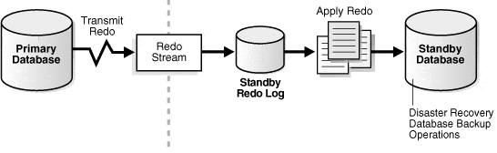

## Oracle Data Guard:
Oracle Data Guard is a comprehensive disaster recovery and high availability solution integrated into the Oracle Database. Data Guard is Oracle’s built-in high availability (HA), disaster recovery (DR), and data protection solution for enterprise databases. It provides a way to maintain synchronized standby databases as replicas of a primary database, ensuring business continuity in case of failure, planned maintenance, or disasters.

### Benefits of Oracle Data Guard:
- **Disaster Recovery** – standby databases at remote sites protect against site failures.
- **High Availability** – automatic failover and switchover minimize downtime.
- **Data Protection** – ensures no/low data loss depending on protection mode.
- **Workload Offloading** – standby databases can be used for backups, reporting, and queries (with Active Data Guard option).
- **Testing** – snapshot standby allows safe testing without affecting production.

### Components of Oracle Data Guard Architecture:

#### 1. Primary Database: 
- The production database that actively serves read/write transactions.
- Changes made here are propagated to standby databases.

#### 2. Standby Databases:
- Replicas of the primary database, kept synchronized through redo data shipping.
- Standbys can be:
    - **Physical Standby** → exact block-for-block copy of the primary, kept in sync via redo apply. Redo logs are Shipped & Applied on Standby Database.
    - **Logical Standby** → contains the same logical data but allows read/write (with some restrictions), synchronized via SQL apply.
    - **Snapshot Standby** → a physical standby temporarily opened read/write for testing; later resynchronized with redo.

#### 3. Redo Transport Services:
- Redo data (transaction logs) generated by the primary database is shipped to standby(s).
- Two main modes:
    - **Synchronous (SYNC)** → guarantees no transaction commit until redo is written at both primary and standby (Zero Data Loss).
    - **Asynchronous (ASYNC)** → primary commits immediately; redo shipped later (possible minimal data loss).

#### 4. Redo Apply Services:
- Redo Apply (Physical Standby) → applies redo logs directly.
- SQL Apply (Logical Standby) → transforms redo into SQL and applies it.

#### 5. Data Guard Broker (optional but recommended): 
- A utility for automating configuration, monitoring, and management via SQL commands or Oracle Enterprise Manager.

### Typical Data Guard Diagram:  

### Types of Standby Databases:

There are 03 types of standby setup:

#### Physical standby: 
- Provides a physically identical copy of the primary database, with disk database structures that are identical to the primary database block by block.
- The database schema, including indexes, is the same. A physical standby database is kept synchronized with the primary database through **Redo Apply**, which retrieves redo data received from the primary database and applies the redo to the physical standby database.
- Redo logs are Shipped & Applied on Standby Database.
- Allows use of ADG option **read-only** and open mode
- Switchover and Failover permitted. 

#### Logical standby: 
- Contains the same logical information as the production database, but the physical organization and structure of the data may be different.
- The logical standby database is kept synchronized with the primary database through **SQL Apply**, which transforms redo data received from the primary database into SQL statements and then executes those SQL statements on the standby database.
- A logical standby database can be used for other business purposes besides disaster recovery. This allows users to access a logical standby database for queries and informational purposes at any time.
- Mainly used for Rolling Upgrades & Redo logs are shipped & transformed to SQL & then they are applied.
- Tables can be open of sql queries (read-only)

#### Snapshot standby: 
- A snapshot Standby Database receives and archives the redo data from the primary database. But snapshot standby will **not apply the redo data**. This redo will be applied only after the snapshot database is converted into the physical standby database.
- read-write mode 
- Switchover and Failover not permitted. 

#### _Oracle Data Guard Standby Database Types:_

| Type             | Description                                                                 | Use Cases                                    | Key Features / Limitations                                                                 |
|------------------|-----------------------------------------------------------------------------|---------------------------------------------|---------------------------------------------------------------------------------------------|
| **Physical Standby** | Block-for-block replica of the primary database, maintained via redo apply. Identical structure and data. | Disaster recovery, high availability.        | Exact copy; can be opened read-only (with Active Data Guard); supports automatic block repair. Cannot be written to while applying redo. |
| **Logical Standby**  | Applies SQL statements derived from redo logs, allowing schema changes or different structures. | Reporting, migrations; offloads reads and limited writes. | Supports read/write on non-replicated tables; some unsupported objects (e.g., SYS-owned tables, compressed tables, certain data types like BFILE or multimedia). |
| **Snapshot Standby** | Temporary read/write version of a physical/logical standby for testing or development. Reverts to standby mode easily. | Application testing without impacting production. | Converts back to standby; uses flashback technology.                                         |

### Protection Modes:

Data Guard offers different protection levels balancing performance and data safety:

#### 1. Maximum Protection:
- It guarantees zero data loss.
- This mode uses the `SYNC` redo transport. 
- Primary waits for the acknowledgment from standby. 
- Primary will halt if standby does not send the acknowledgment. 
- In this mode the redo/transaction data must be written to both primary redo log and standby redo log. 
- Synchronous redo transport requires acknowledgment from at least one standby before committing. If standby fails, primary shuts down to prevent loss.
- Primary shuts down if it cannot write redo to at least one synchronized standby.

#### 2. Maximum Availability:
- Zero data loss under normal operation (`SYNC` mode).
- It requires the `SYNC` redo transport. 
- If standby unavailable, primary continues without shutdown (like Maximum Performance).
- In the event that the standby server is unavailable the primary will wait the specified time in the `NET_TIMEOUT` parameter before giving up on the standby server and allowing the primary to continue to process. Once the connection has been re-established the primary will automatically resynchronize the standby database.
- Primary to continue and standby to fall slightly behind 

#### 3. Maximum Performance:
- This is the default protection mode. Minimal impact on primary. 
- Redo shipped asynchronously (minimal performance impact).
- This mode requires `ASYNC` redo transport so that the **LGWR** process never waits for acknowledgment from the standby database. 
- Possible minimal data loss.

### Active Data Guard vs Normal Data Guard: 

Two Types of Data Guard based on requirement:

#### Active Data Guard:
Active Data Guard enables **read-only access** to a physical standby database for queries, sorting, reporting, Web-based access, and so on, while **continuously applying changes** received from the primary database.
- Provides all DR/HA features of Data Guard plus allows the standby to be opened **READ-ONLY** while applying redo.
- Enables queries, reporting, analytics, and backups on the standby without impacting the primary.

####  Normal Data Guard:
Normal Data Guard enables you to switch to the Standby Database when primary database is down due to some outage or natural calamities. In normal Data guard, you can **still open the standby database** in read-mode but **changes not applied** while in read-only mode.
- Focuses on **disaster recovery** and **high availability** (standby is mostly idle).
- Standby databases are usually in **MOUNT mode** (not queryable).
- Mainly used for failover, switchover, and data protection.

### Data Guard Management:
_You have three options on which to manage Data Guard:_

- SQL*Plus
- Data Guard Broker - distributed management tool that centralizes management , uses DGMGRL command line.
- Enterprise Manager - provides a GUI to the Data Broker replacing DGMGRL

### Data Guard Broker:

Oracle Data Guard Broker is a management framework that automates and simplifies the creation, maintenance, and monitoring of Data Guard configurations. It provides a centralized control mechanism for the primary and standby databases, enabling easier administration of high availability (HA) and disaster recovery (DR) environments.

### Switchover and Failover:

#### Switchover:
Switchover is a planned event, it is ideal when you might want to upgrade the primary database or change the storage/hardware configuration (add memory, cpu networking).

_What happens during a switchover is the following:_
1. Notifies the primary database that a switchover is about to occur
2. Disconnect all users from the primary database
3. Generate a special redo record that signals the End of Redo (EOR)
4. Converts the primary database into a standby database
5. Once the standby database applies the final EOR record, guaranteeing that no data loss has been lost, converts the standby database into the primary database.

#### Failover:
Failover is a unplanned event. The standby is promoted to primary to ensure availability.

### License:
This project is licensed under the **MIT** License.

### Author:
- **Name:** Technbd   
- **Topic:** Oracle RMAN Backup & Recovery Notes  

Oracle Data Guard ensures business continuity by replicating a primary database to one or more standby databases, supporting role transitions, and enabling high availability with minimal data loss.

