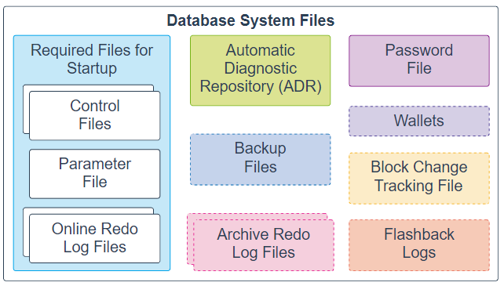
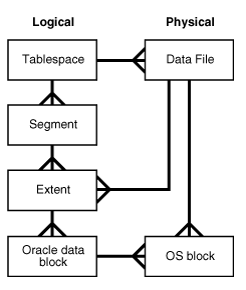
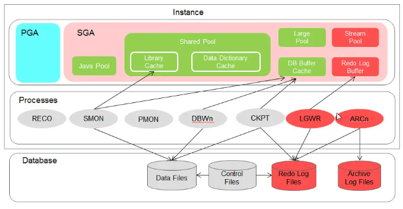
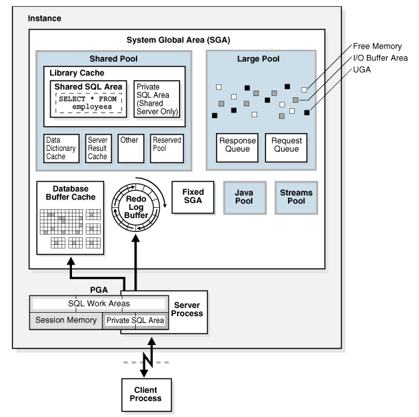
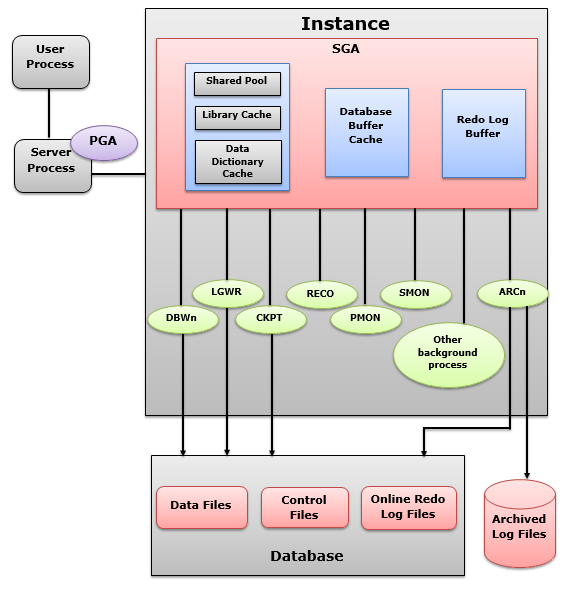

## Oracle Database Architecture Overview:


The Oracle Database architecture consists of a **database** and **at least one instance**, working together to manage and access data. This architecture can be understood by examining its key components:


### 1. Oracle Database:

### a. Physical Structure:
Consists of physical files stored on disk, including **data files** (containing the actual data), **control files** (containing metadata about the database structure), and **redo log files** (recording all changes made to the database for recovery purposes).

- **Data files**: Data files store the actual data within the database. These files are organized into logical structures called tablespaces. This files contain logical database structures, shuch as tables and indexes.

- **Control files**: Control files are pivotal to the operation of an Oracle database. In particular, they store metadata about the database, including the names and locations of data files and redo log files, the database name, and other critical information. Moreover, control files are indispensable during database startup and recovery.

    - Every oracle database has at least one control file. The control file contains metadata specifying the physical structure of the database, including the database name and the names and location of the database files.
    - The control file in oracle is a small binary file necessary for the database to start and operate successfully. Each control file is associated with only one oracle database. Before a database is opened, the control file in oracle is read to determine if the database is in a valid state to use.
    - Oracle server updates the control file continuously during the database is in use. 
    - Only the oracle server can modify the information in the control file, no DBA or end-user can edit the control file. 
    - Control file ছাড়া  database start হবে না।
    - Control file না থাকলে বা corrupt হলে  database কাজ করবে না। 
    - Database structure change, backup related, commit and etc store in control file 
    - Database creation info, datafile location, redo log location store in control file. 


- **Online Redo log files**: Redo log files capture all changes made to the database, ensuring data integrity and enabling recovery in the event of a failure.

    - Every oracle database has an online redo log, which is a set of two or more online redo log files. An online redo log is a made up of redo entries (also called redo records), which record all changes made to data. 
    - Data level এর সকল changes গুলি থাকে। 
    - DML command এর changes metrics থাকে redo log ফাইলে। 
    - Redo log থাকে physical 
    - Redo log buffer থাকে  memory তে।   
    - committed and uncommitted data store 
    - At a time write one file 


```
select * from v$log;
select * from v$logfile;
select GROUP#, member from v$logfile;

alter system switch logfile;
```


Besides these files, an Oracle database includes other important files such as **parameter files**, **network files**, **backup files**, and **archived redo log files** for backup and recovery.

```
- Data files: যত ধরনের ডাটা আছে সব  Data file-এ থাকবে। 
- Control files: insert, update, delete এর  কারনে databse structure-এ পরিবর্তন হচ্ছে এর metadata'র  information save হবে Control file-এ। 
- Online redo log files: Crash recovery
- Parameter file: যখন  databse start/run হবে তখন  Parameter file প্রয়োজন। 
- Automatic diagnostic repository: Monitoring and health check. 
- ARCHIVE LOG: 
```




- **Parameter file**: 
    - Every oracle database has a parameter file, which defines how the instance is configured when it starts up.
    - Database যখন  start করি তখন  parameter file লাগে।  database কত মেমোরি পাবে, Control file কোথায়, archive file এর  লোকেশন কোথায়, অন্যান্য ফাইল ও  সকল প্যারামিটার গুলি  Parameter file থাকে।


- **Archive Logs**:
    - ARCn process are present only when the database is ARCHIVELOG mode, and automatic archiving is enabled ARCn responsible for copying online redo log to archival storage. 
    - When a log switch, the ARCH process copies the contents of the log file just filled to the `ARCHIVE_LOG_DEST` directory. 


- **Audit log**:
    - IP address
    - OS user


### b. Logical Structure:
Organizes data logically, independent of its physical storage. Key logical structures include:
- **Tablespaces**: Logical storage units that group related data segments and are mapped to physical data files. **Tablespaces are logical containers for a segment. Each tablespace consists of at least one data file.**
- **Segments**: A segment is a set of extents **allocated for storing database objects**, e.g., a table or an index.
- **Extents**: A collection of contiguous data blocks within a segment. **An extent is a specific number of logically contiguous data blocks used to store a particular type of information**.
- **Data Blocks**: The smallest unit of logical storage, corresponding to a specific number of operating system blocks. **A data block corresponds to a number of bytes on the disk. Oracle stores data in data blocks.** 

```
Note:

- Contiguous data blocks (Extents): logical
- Oracle data block (Block): physical (OS block)
- Block এর মধ্যে  Table এর ডাটা   Row piece আকারে ডাটা রাখে। 
```





_Every Oracle database is made up of multiple Tablespaces:_
```
Oracle default tablespaces: 
- SYSTEM
- SYSAUX
- UNDO
- TEMP
- USERS
```


- `SYSTEM` Tablespace: For managing database. The system tablespace includes the **data dictionary, tables, views that contain administrative information** about the database along with oracle provided stored objects such as triggers, procedures and packages.

- `SYSAUX` Tablespace: SYSAUX is an auxiliary tablespace that has become mandatory since Oracle 10g. Used by oracle components including **oracle enterprize manager and oracle strems** as their defaults storage location.

- `UNDO` Tablespace: Used for **storing system-managed transaction rollback** data.

- `TEMP` Tablespace: Contains transient data that **persists only for the duration of session**. TEMP is a tablespace **containing temporary data and indexes**. Temporary tablespaces are necessary for work with large tables and clauses like DISTINCT, GROUP BY, and ORDER BY. 

- User-defne Tablespace: `USERS` is a permanent tablespace containing the application data. Oracle fills this space with the data created and entered by the users. For storing user and/or application-related data. 


```
SELECT tablespace_name from dba_tablespaces;
```

> [!NOTE]
> `SYSTEM` and `SYSAUX` are created and filled by Oracle, and users should not add/store any objects there.


### 2. Oracle Instance:

A Database Instance is an interface between client applications (users) and the database.

An Oracle instance consists of three main parts: 
- System Global Area (SGA)
- Program Global Area (PGA)
- background processes.


### a. Memory Structures:

### System Global Area (SGA):
The SGA is a shared memory area used by an Oracle instance. Specifically, it **contains data and control information** crucial for database operation. Some key components of the SGA include the database **buffer cache**, **shared pool**, **redo log buffer**, and **large pool**.

_The SGA is responsible for:_
- Caching data blocks read from a disk.
- Managing internal data structures that are accessed by multiple processes and threads simultaneously.
- Storing Structured Query Language (SQL) implementation plans.
- Buffering and writing redo data to the online redo log files.





_The SGA includes the following data structures:_

- **Shared pool**:  The shared pool stores the data dictionary and the most recently used SQL statements (shared SQL or library cache). This is where the parsing phase of the SQL statements takes place.

    - Caches PL/SQL statements or code libraries. Cache of data dictionary.
	- Library cache: all executable code like SQL/PLSQL. SQL AREA.
	- Library cache Query Parse করে database এর উপযোগি করে । 
	- Data dictionary cache: user permitions. 


- **Database buffer cache**: The database buffer stores the most recently used data. It also contains the rollback buffers, which store the previous image of the data. Rollback buffers also provide consistency in reading.

    - Contains copies of blocks of data retrieved from the database.
	- A buffer is a database block-sized chunk of memory. 
	- read from datafiles using DBWR. 
	

- **Redo log buffer cache**:  Redo log buffers provide sequential access and record all changes made to the database by insert, update, delete, create, alter, and drop operations with the minimum necessary information. Essentially, their function is to provide security against a database crash.

    - Buffers redo log information (used for instance recovery) until written to physical redo log files. 
	- Old and new values are kept in log buffer, as block changes. 
	
- **Java pool**: Used for all session-specific java code and data in the JVM.

- **Large Pool**:  Optional area that provides large memory allocations for certain large processes, such as Oracle backup and recovery operations, and I/O server processes.

	- For parallel query like RMAN 
	- Session memory for shared server 
	- Fast insert ingestion 
	- Streaming 


- Stream pool:– Used by Oracle Streams to store information required by capture and apply.

- Flashback buffer: Holds modified blocks from the buffer cache before being written to the Flashback database logs.

- Fixed SGA: Internal housekeeping area containing general information about the state of the database. 

- Shared i/o pool (secure files): For large i/o operations on secure file large objects (LOBs).


### Program Global Area (PGA):
The PGA is a private memory area allocated to each server process or background process. It **contains data and control information specific to a user session.**

The PGA is a non-shared memory region that contains data and control information exclusively for use by server and background processes. Oracle database create server processes to handle connections to the database on behalf of client programs likes: SQL work area and Session memory. 


The PGA is:
- PGA is the memory reserved for each user process connecting to an Oracle Database and is allocated when a process is created and deallocated when a process is terminated.
- Responsible for processing SQL statements and holding logon and other session data.
- Dedicated to SQL **work areas**. Work areas are active memory areas for sorts and other SQL operations.


```
show database memory parameters;
show memory parameters;
show parameter memory;

select sum(value)/1024/1024 "TOTAL SGA (MB)" from v$sga;

TOTAL SGA (MB)
--------------
    707.996437
```





### b. Background Processes:

Background Processes are responsible for managing memory structures individually. They handle the reception and transmission of information, commonly referred to as performing input/output, which includes writing data to disk files

A set of processes that perform various essential tasks for the database, such as:
- **Database Writer (DBWn)**: Database Writer. Writes modified data blocks from the Database Buffer Cache to data files.
- **Log Writer (LGWR)**: Redo Log Writer. Writes redo log entries from the Redo Log Buffer to redo log files.
    - Every 3 seconds
	- when 1/3 redo log buffer area is full. 
	- commit operation occurs
	- log switch occurs.

- **Process Monitor (PMON)**: Process Monitor. Performs process recovery. PMON responsible for registering database service to listener.
	- Periodically scans all process to find any that have died abnormally. Cleans up failed user processes.

- **System Monitor (SMON)**: System Monitor. Performs instance recovery and cleans up temporary segments.

- **Checkpoint (CKPT)**: Signals DBWn to write dirty buffers to disk and updates control files.
	- When log switch (alter system switch logfile;)
	- When normally forced by DB administrator
	- If the datafile is offline checkpoint is occurs
	- Tablespace read only or offline occurs 
	- alter system checkpoint;
	- alter database begin backup; 
	- log writer process or checkpoint process generate করলে  SCN number তৈরি হয়। 

- ARCn: Redo Log Archiver. The archiver process that copies the content of redo logs to archive redo log files.
- LREG (Listener Registration):
- RECO: Recoverer process. In a distributed database, the recovery process automatically resolves failures in distributed transactions.
- MMON: Performs various manageability related background task (issue alerts, take snapshots, capture statistics values)
- MMAN - Memory Manager process which will help in automatic memory management when use sga_target,memory_target.
- Optional Process: CJQ0, FBDA, SMCO, etc. 





```
ps -ef | grep ora_
ps -ef | grep dbw
ps -ef | grep lgw


SQL> show parameter db_writer;
SQL> show parameter dbwr_io;


SQL> alter system checkpoint;  [-> For DB fast shutdown]
```


### 3. Oracle Net Services:
- Facilitates communication between client applications and the Oracle Database server, enabling remote access and distributed database operations.
- Includes components like the Oracle Net Listener, which manages incoming connection requests from clients.

### 4. Client-Server Architecture:
- Oracle Database operates in a client-server model, where client applications connect to the database server to access and manipulate data.
- Server processes handle client requests, manage data, and interact with the physical and logical database structures.


---
---


## Instance vs. Database: 
An Oracle Database consists of a database and at least one instance: 

#### a. Instance:
An instance (a database instance) combines memory and operating system processes in a running installation.

Instance হচ্ছে  database engine. একটা engine এর উপর অনেক গুলি Database থাকতে পারে।  Instance made on memory and background process.  Instance, Database কে রান করানোর কাজে লাগে।  Background process Database এর সাথে connected থাকে.  

- **Oracle binary Install**: Instance + Database.
- **Instance**: is memory (SGA) and some of background process.


```
How They Work Together:

Instance = Brain (active, in memory)
Database = Body (stored, on disk)
```


#### b. Database:
A database is a collection of files that hold data (data files, temporary files, redo log files, and control files).

- Database হয় অনেক গুলি ফাইল নিয়ে  (data files, control files, online redo log, parameter file).  Database, Instance এর  memory and background process নিয়ে রান হয়। 


### Oracle Instance vs Oracle Database:

| Aspect                  | **Instance**                                                  | **Database**                                                            |
| ----------------------- | ------------------------------------------------------------- | ----------------------------------------------------------------------- |
| **Definition**          | A **set of memory structures and background processes**       | A **set of physical files** that store data                             |
| **Purpose**             | Manages access to the database                                | Stores persistent data                                                  |
| **Key Components**      | SGA, PGA, DBWn, LGWR, SMON, PMON, etc.                        | Datafiles, control files, redo logs, temp files                         |
| **Lifespan**            | Exists in **memory while Oracle is running**                  | Exists **permanently on disk**                                          |
| **Start/Stop**          | You **start or stop the instance** using `startup`/`shutdown` | The **database becomes available or unavailable** based on the instance |
| **Multiple Instances?** | Yes, in **RAC** (Real Application Clusters)                   | Yes, multiple instances can access a single DB in RAC setup             |
| **Storage Location**    | In **RAM / memory**                                           | On **disk / file system**                                               |


