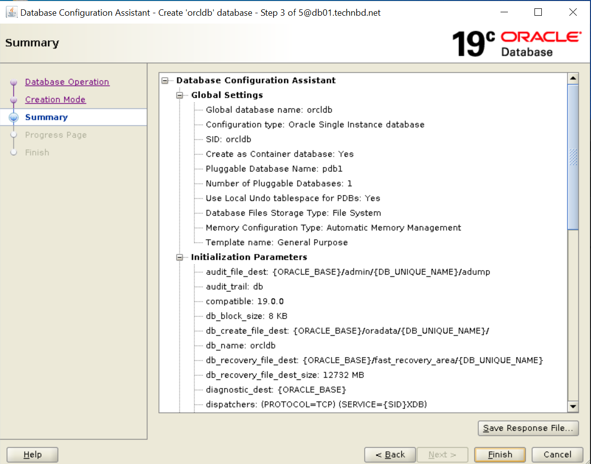

## Oracle Database Installation:

This article describes the **installation of Oracle Database 19c** 64-bit on Oracle Linux 8.9 (OL8.9) 64-bit. 


### Oracle Database Installation Types:

1. Standalone/Single Instance
    - OS File System
		- OUI (Oracle Universal Installer) - (Recommanded)
			- Install (OH) Binary + Create (DB)
			- Install (OH (oracle home)) Binary 
			- Create (DB (dbca))

			- Silent (CLI)
				- Install (OH)
				- Create (DB)
				
		- RAW/OCFS/SAN/NFS
			- OUI or Silent

		- ASM Disks/Disk Groups
			- ASM

2. RAC/Real Application Cluster
	- ASM (Recommanded/ Must be)
		- GI (Grid) <<-- OUI or Silent
			- Install (OH) Binary + Create (DB)
			- Install (OH) Binary 
			- Create (DB) (dbca)


### Prerequisites: 
- Disable SElinux
- Disable firewalld
- Set Data and time 


#### Environment: 

```
cat /etc/oracle-release

Oracle Linux Server release 8.9
```


```
uname -mrs

Linux 5.15.0-200.131.27.el8uek.x86_64 x86_64
```


_Set Hostname:_
```
vim /etc/hostname

db01.technbd.net
```


_Set Hosts Entry:_
```
vim /etc/hosts

192.168.10.191		db01.technbd.net        db01
```


### Pre-Installation Tasks: 

Checking Server Hardware and Memory Configuration:

_You need to have at least **2048 MB** of space in the `/tmp` directory:_
```
df -h /tmp
```


```
df -h /dev/shm/

Filesystem      Size  Used Avail Use% Mounted on
tmpfs           1.8G  864M  945M  48% /dev/shm
```


#### If Resize `/dev/shm`:

Edit `/etc/fstab` (if using `tmpfs`):
```
vim /etc/fstab

tmpfs                   /dev/shm                tmpfs   defaults,size=4G 0 0
```


```
mount -o remount /dev/shm
```


```
df -h /dev/shm/

Filesystem      Size  Used Avail Use% Mounted on
tmpfs           4.0G  864M  3.2G  22% /dev/shm
```


_Check Physical RAM and SWAP:_
```
grep MemTotal /proc/meminfo

grep SwapTotal /proc/meminfo
```


_Check Kernel Parameters and User Limits:_
```
less /etc/sysctl.conf

less /etc/security/limits.conf
```


```
cat /etc/passwd | grep oracle
cat /etc/group | grep oracle
```


### Install Required Packages: 

#### Automatic Setup: 


_If you plan to use the `oracle-database-preinstall-19c` package to perform all your prerequisite setup:_

```
yum search oracle-database-preinstall-19c

yum install -y oracle-database-preinstall-19c

yum update -y

yum install -y unixODBC
```


_If you are using **RHEL8 or CentOS8**, you can pick up the RPM from the **OL8 repository and install it**:_
```
curl -o oracle-database-preinstall-19c-1.0-2.el8.x86_64.rpm https://yum.oracle.com/repo/OracleLinux/OL8/appstream/x86_64/getPackage/oracle-database-preinstall-19c-1.0-2.el8.x86_64.rpm

dnf localinstall -y oracle-database-preinstall-19c-1.0-2.el8.x86_64.rpm
```


_Check the RPM log file to review the system configuration changes:_
```
ll /var/log/oracle-database-preinstall-19c/backup/<time_stamp>/orakernel.log
```


```
cat /etc/passwd | grep oracle

oracle:x:54321:54321::/home/oracle:/bin/bash
```


```
cat /etc/group | grep oracle

oinstall:x:54321:oracle
dba:x:54322:oracle
oper:x:54323:oracle
backupdba:x:54324:oracle
dgdba:x:54325:oracle
kmdba:x:54326:oracle
racdba:x:54330:oracle
```


```
id oracle

uid=54321(oracle) gid=54321(oinstall) groups=54321(oinstall),54322(dba),54323(oper),54324(backupdba),54325(dgdba),54326(kmdba),54330(racdba)
```


```
passwd oracle
```


#### If Manual Setup:

_Add the following lines to the `/etc/sysctl.conf` file, or in a file called `/etc/sysctl.d/98-oracle.conf`:_
```
fs.file-max = 6815744
kernel.sem = 250 32000 100 128
kernel.shmmni = 4096
kernel.shmall = 1073741824
kernel.shmmax = 4398046511104
kernel.panic_on_oops = 1
net.core.rmem_default = 262144
net.core.rmem_max = 4194304
net.core.wmem_default = 262144
net.core.wmem_max = 1048576
net.ipv4.conf.all.rp_filter = 2
net.ipv4.conf.default.rp_filter = 2
fs.aio-max-nr = 1048576
net.ipv4.ip_local_port_range = 9000 65500
```


```
/sbin/sysctl -p

Or,

/sbin/sysctl -p /etc/sysctl.d/98-oracle.conf
```


_Add the following lines to a file called `/etc/security/limits.conf` or `/etc/security/limits.d/oracle-database-preinstall-19c.conf`:_
```
oracle   soft   nofile    1024
oracle   hard   nofile    65536
oracle   soft   nproc    16384
oracle   hard   nproc    16384
oracle   soft   stack    10240
oracle   hard   stack    32768
oracle   hard   memlock    134217728
oracle   soft   memlock    134217728
```


_The following **packages** are listed as required (If Manual Setup):_
```
yum install -y unixODBC
```


#### Create the new groups:_

- `–g`: option to use a custom GID 

```
groupadd -g 54321 oinstall
groupadd -g 54322 dba
groupadd -g 54323 oper

groupadd -g 54324 backupdba
groupadd -g 54325 dgdba
groupadd -g 54326 kmdba
groupadd -g 54330 racdba

#groupadd -g 54327 asmdba
#groupadd -g 54328 asmoper
#groupadd -g 54329 asmadmin
```


#### Create users:

- `-g`: Lowercase `-g` option refers to a primary group.
- `-G`: Uppercase `-G` option refers to a secondary or supplementary group

```
useradd -u 54321 -g oinstall -G dba,oper oracle
```


#### Add user to`sudo` Group (Optional): 

```
sudo visudo


### Allow root to run any command anywhere
root  ALL=(ALL)       ALL

oracle  ALL=(ALL)     ALL
```


### Create the directories (Create Manually):

Create the directories in which the Oracle software will be installed: 

```
mkdir -p /u01/app/oracle/product/19.0.0/dbhome_1
chown -R oracle:oinstall /u01
chmod -R 775 /u01

mkdir -p /u02/oradata
chown -R oracle:oinstall /u02
chmod -R 775 /u02
```


### Create Oracle Environment File:

- `ORACLE_BASE`: contain different type of log files 
- `ORACLE_HOME`: contain binary (instance)


```
su - oracle
```


```
vim ~/.bash_profile


### Add for oracle user:
export TMP=/tmp
export TMPDIR=$TMP

#export ORACLE_HOSTNAME=orcldb.local

export ORACLE_BASE=/u01/app/oracle
export ORACLE_HOME=$ORACLE_BASE/product/19.0.0/dbhome_1

## Oracle SID (instance name)
export ORACLE_SID=orcldb        ## <-- Ensure this matches your actual DB SID
export ORACLE_UNQNAME=orcldb
export PDB_NAME=pdb1

export NLS_DATE_FORMAT="DD-MON-YYYY HH24:MI:SS"
export TNS_ADMIN=$ORACLE_HOME/network/admin

export LD_LIBRARY_PATH=$ORACLE_HOME/lib:/lib:/usr/lib
export CLASSPATH=$ORACLE_HOME/jlib:$ORACLE_HOME/rdbms/jlib

## Add Oracle to PATH:
export PATH=$ORACLE_HOME/bin:$PATH:$HOME/.local/bin
```


```
source ~/.bash_profile
```


```
echo $ORACLE_HOME
echo $ORACLE_SID
echo $ORACLE_UNQNAME
```


### Download/Upload oracle 19c software:

_Download Oracle 19c software (https://www.oracle.com/apac/database/technologies/oracle19c-linux-downloads.html) to oracle home directory:_

```
cd $ORACLE_HOME

ll LINUX.X64_193000_db_home.zip

unzip LINUX.X64_193000_db_home.zip
```


### Installation:

#### Install Software Only (GUI): 

```
./runInstaller
```

1. Configuration Option: 
	- [ ] Create and configure a single instance database.  [-> Install Engine and Database]
	- [✔] Set Up Software Only   [-> Install only Engine]
	- Next


2. Database Installation Options: 
	- [✔] Single instance database installation
	- [ ] Oracle RAC clusters database installation
	- Next


3. Database Edition: 
	- [✔] Enterprise Edition
	- [ ] Standard Edition 2
	- Next


4. Installation Location: 
	- Oracle base: `/u01/app/oracle`
	- Next


5. Create Inventory: 
	- Inventory Directory: `/u01/app/oraInventory`
	- oraInventory Group Name: `oinstall`
	- Next:


6. Operating System Groups: `Note`: All are select `oinstall` no issues but RAC install different groups. 
	- Database Administrator (OSDBA) group: `oinstall`
	- Database Operator (OSOPER) group (Optional): `oper`
	- Database Backup Recovery (OSBACKUPDBA) group: `oinstall`
	- Data Guard Administrative (OSDGDBA) group: `oinstall`
	- Encryption key Management Administrative (OSMKDBA) group: `oinstall`
	- RAC cluster Administrative (OSRACDBA) group: `oinstall`
	- Next


7. Root script execution: 
	- [ ] Automatically run configuration scripts
	- Next


8. Prerequisite Checks:


9. Summary: 
	- click `Install`


10. Install Product: 


_Run the 02 scripts when prompted `root` user:_
```
/u01/app/oraInventory/orainstRoot.sh


### Output: 
Changing permissions of /u01/app/oraInventory.
Adding read,write permissions for group.
Removing read,write,execute permissions for world.

Changing groupname of /u01/app/oraInventory to oinstall.
The execution of the script is complete.
```


```
/u01/app/oracle/product/19.0.0/dbhome_1/root.sh


### Output: 
Performing root user operation.

The following environment variables are set as:
    ORACLE_OWNER= oracle
    ORACLE_HOME=  /u01/app/oracle/product/19.0.0/dbhome_1

Enter the full pathname of the local bin directory: [/usr/local/bin]:
   Copying dbhome to /usr/local/bin ...
   Copying oraenv to /usr/local/bin ...
   Copying coraenv to /usr/local/bin ...


Creating /etc/oratab file...
Entries will be added to the /etc/oratab file as needed by
Database Configuration Assistant when a database is created
Finished running generic part of root script.
Now product-specific root actions will be performed.
Oracle Trace File Analyzer (TFA - Standalone Mode) is available at :
    /u01/app/oracle/product/19.0.0/dbhome_1/bin/tfactl

Note :
1. tfactl will use TFA Service if that service is running and user has been granted access
2. tfactl will configure TFA Standalone Mode only if user has no access to TFA Service or TFA is not installed
```


10. Finish: 
	- The registration of Oracle database was successful. 
	- Close [Finish]


_Verify:_
```
sqlplus -v

SQL*Plus: Release 19.0.0.0.0 - Production
Version 19.3.0.0.0
```


```
sqlplus /nolog

SQL*Plus: Release 19.0.0.0.0 - Production on Mon Aug 4 00:19:41 2025
Version 19.3.0.0.0

Copyright (c) 1982, 2019, Oracle.  All rights reserved.


SQL> conn /as sysdba
Connected to an idle instance.
SQL>
```


```
desc v$version;
SELECT * FROM v$version;


BANNER
--------------------------------------------------------------------------------
BANNER_FULL
--------------------------------------------------------------------------------
BANNER_LEGACY
--------------------------------------------------------------------------------
    CON_ID
----------
Oracle Database 19c Enterprise Edition Release 19.0.0.0.0 - Production
Oracle Database 19c Enterprise Edition Release 19.0.0.0.0 - Production
Version 19.3.0.0.0
Oracle Database 19c Enterprise Edition Release 19.0.0.0.0 - Production
         0

BANNER
--------------------------------------------------------------------------------
BANNER_FULL
--------------------------------------------------------------------------------
BANNER_LEGACY
--------------------------------------------------------------------------------
    CON_ID
----------
```


### Create/Install Database using `dbca` (GUI):

```
cd $ORACLE_HOME
ll bin/dbca
```


#### Typical configuration and Install: 


```
dbca
```


1. Database Operation:
	- [✔] Create a database
	- Next


2. Creation Mode: 
	- [✔] Typical configuration:
		- Global database name: `orcldb`
		- Storage type: `File System`
		- Database files location: `{ORACLE_BASE}/oradata/{DB_UNIQUE_NAME}`
		- Fast Recovery Area (FRA): `{ORACLE_BASE}/fast_recovery_area/{DB_UNIQUE_NAME}`
		- Database character set: `AL32UTF8 - Unicode UTF-8 Universal character set`
		- Administrative pass: `oracle123`  [For create password file use this password]
		- Confirm pass: `oracle123`
		- [✔] Create as container database   [If container DB no create for this uncheck it, by default checked]
			- Pluggable database name: `pdb1`
	- Next.


3. Summary: 
	- Finish 

  
  
  


4. Progress Page: 


5. Finish: 
	- Close


> [!NOTE]  
> All database account are locked except `SYS` and `SYSTEM`. 


#### Advanced configuration and Install: 

```
dbca
```


1. Database Operation:
	- [✔] Create a database
	- Next


2. Creation Mode: (**Advanced Recommanded**)
	- [✔] Advanced configuration:
	- Next 


3. Deployment Type: 
	- Database type: `Oracle single instance database`
	- Select a template for your database:
		- [ ] Data Warehouse
		- [ ] Custom Database 
		- [✔] General Purpose or Transaction Processing
		- Next


4. Database Identification: 
	- Global database name: `orcldb`
	- SID: `orcldb`
	- [✔] Create as container database   [If container DB no create for this uncheck it, by default checked]
		- [✔] Use Local Undo tablespace for PDBs
		- [ ] Create an empty Container database
		- [✔] Create a Container database with one or more PDBs
		- Number of PDBs: 1
		- Pluggable database name: `pdb1`
	- Next.


5. Storage Option: 
	- [ ] Use template file for database storage attributes
	- [✔] Use Following for the database storage attributes
		- Database files storage type: `File System`
		- Database files location: `{ORACLE_BASE}/oradata/{DB_UNIQUE_NAME}`
	- [ ] Use Oracle-Managed Files (OMF)
	- Next 


6. Fast Recovery Option: 
	- [✔] Specify Fast Recovery Area  [Checked it]
		- Recovery files storage type: `File System`
		- Fast Recovery Area: `{ORACLE_BASE}/fast_recovery_area/{DB_UNIQUE_NAME}`
		- Fast Recovery Area size: 12732 MB
	- [ ] Enable archiving 
	- Next


7. Network Configuration: 
	- Listener selection: [Create later]
	- Next


8. Data Vault Option: 
	- [ ] Configure Oracle Database Vault
	- [ ] Configure Oracle Label Security 
	- Next


9. Configuration Options: 
	- Memory Tab: 
		- [ ] Use Automatic Shared Memory Management
			- SGA size: 1084 MB
			- PGA size:  362 MB 
		- [ ] Use Manual Shared Memory Management
		- [✔] Use Automatic Memory Management
			- Memory target: [ 1446 MB ]     [Physical RAM: 4GB of 39%]

	- Character sets Tab:
		- [✔] Use Unicode (AL32UTF8)
	- Connection mode Tab:
		- [✔] Dedicated server mode
	- Sample schemas 
		- [ ] Add sample schemas to the database 
	- Next


10. Management Options:
	- [✔] Configure Enterprise Manager (EM) database express:
		- EM database express port: `5500`
		- [ ] Configure EM database express port as global port
	- [ ] Register with Enterprise Manager (EM) cloud control 
	- Next


11. User Credentials: 
	- [ ] Use different administrative passwords:
		- SYS: 
		- SYSYEM: 
		- PDBADMIN: 
	- [✔] Use the same administrative password for all accounts:
		- Password: oracle1234
	- Next


12. Creation Option: 
	- [✔] Create database
		- Port DB creation scripts: [  ]
	- [ ] Save as a database template
	- [ ] Generate database creation scripts
	- Next


13. Summary: 
	- Finish

  
  
  


14. Progress Page:


15. Finish:
	- Close


### Verify: 

_System monitoring:_
```
ps -ef | grep smon

oracle    473156       1  0 13:06 ?        00:00:00 ora_smon_orcldb
```


_Process Monitor:_
```
ps -ef | grep pmon

oracle    473114       1  0 13:06 ?        00:00:00 ora_pmon_orcldb
```


```
sqlplus / as sysdba
```


```
select instance_name, status from v$instance;

INSTANCE_NAME    STATUS
---------------- ------------
orcldb           OPEN
```


```
show parameter ins

NAME                                 TYPE        VALUE
------------------------------------ ----------- ------------------------------
active_instance_count                integer
cluster_database_instances           integer     1
dst_upgrade_insert_conv              boolean     TRUE
instance_abort_delay_time            integer     0
instance_groups                      string
instance_mode                        string      READ-WRITE
instance_name                        string      orcldb
instance_number                      integer     0
instance_type                        string      RDBMS
instant_restore                      boolean     FALSE
open_links_per_instance              integer     4

NAME                                 TYPE        VALUE
------------------------------------ ----------- ------------------------------
parallel_instance_group              string
```


```
show parameter instance

NAME                                 TYPE        VALUE
------------------------------------ ----------- ------------------------------
active_instance_count                integer
cluster_database_instances           integer     1
instance_abort_delay_time            integer     0
instance_groups                      string
instance_mode                        string      READ-WRITE
instance_name                        string      orcldb
instance_number                      integer     0
instance_type                        string      RDBMS
open_links_per_instance              integer     4
parallel_instance_group              string
```


```
show pdbs;

    CON_ID CON_NAME                       OPEN MODE  RESTRICTED
---------- ------------------------------ ---------- ----------
         2 PDB$SEED                       READ ONLY  NO
         3 PDB1                           MOUNTED
```


```
show sga

Total System Global Area 1526723568 bytes
Fixed Size                  9135088 bytes
Variable Size             922746880 bytes
Database Buffers          587202560 bytes
Redo Buffers                7639040 bytes
```


```
show parameter spfile;

NAME                                 TYPE        VALUE
------------------------------------ ----------- ------------------------------
spfile                               string      /u01/app/oracle/product/19.0.0
                                                 /dbhome_1/dbs/spfileorcldb.ora
```


```
desc dba_data_files;

select FILE_NAME,STATUS,ONLINE_STATUS from dba_data_files;

FILE_NAME                                          STATUS               ONLINE_
-------------------------------------------------- -------------------- -------
/u01/app/oracle/oradata/ORCLDB/system01.dbf        AVAILABLE            SYSTEM
/u01/app/oracle/oradata/ORCLDB/sysaux01.dbf        AVAILABLE            ONLINE
/u01/app/oracle/oradata/ORCLDB/undotbs01.dbf       AVAILABLE            ONLINE
/u01/app/oracle/oradata/ORCLDB/users01.dbf         AVAILABLE            ONLINE
```


```
set pagesize 100
COLUMN name FORMAT A55
COLUMN status FORMAT A20

select name, status from v$datafile; 

NAME                                                    STATUS
------------------------------------------------------- --------------------
/u01/app/oracle/oradata/ORCLDB/system01.dbf             SYSTEM
/u01/app/oracle/oradata/ORCLDB/sysaux01.dbf             ONLINE
/u01/app/oracle/oradata/ORCLDB/undotbs01.dbf            ONLINE
/u01/app/oracle/oradata/ORCLDB/pdbseed/system01.dbf     SYSTEM
/u01/app/oracle/oradata/ORCLDB/pdbseed/sysaux01.dbf     ONLINE
/u01/app/oracle/oradata/ORCLDB/users01.dbf              ONLINE
/u01/app/oracle/oradata/ORCLDB/pdbseed/undotbs01.dbf    ONLINE
/u01/app/oracle/oradata/ORCLDB/pdb1/system01.dbf        SYSTEM
/u01/app/oracle/oradata/ORCLDB/pdb1/sysaux01.dbf        ONLINE
/u01/app/oracle/oradata/ORCLDB/pdb1/undotbs01.dbf       ONLINE
/u01/app/oracle/oradata/ORCLDB/pdb1/users01.dbf         ONLINE
```


```
show parameter control

NAME                                 TYPE        VALUE
------------------------------------ ----------- ------------------------------
control_file_record_keep_time        integer     7
control_files                        string      /u01/app/oracle/oradata/ORCLDB
                                                 /control01.ctl, /u01/app/oracl
                                                 e/fast_recovery_area/ORCLDB/co
                                                 ntrol02.ctl
control_management_pack_access       string      DIAGNOSTIC+TUNING
```


```
desc v$logfile;

select MEMBER from v$logfile;

MEMBER
-------------------------------------------------------
/u01/app/oracle/oradata/ORCLDB/redo03.log
/u01/app/oracle/oradata/ORCLDB/redo02.log
/u01/app/oracle/oradata/ORCLDB/redo01.log
```


```
alter system switch logfile;
```


```
desc v$log;
select * from v$log;

select GROUP#,MEMBERS,STATUS from v$log;

    GROUP#    MEMBERS STATUS
---------- ---------- --------------------
         1          1 INACTIVE
         2          1 INACTIVE
         3          1 CURRENT
```


```
archive log list;


Database log mode              No Archive Mode
Automatic archival             Disabled
Archive destination            USE_DB_RECOVERY_FILE_DEST
Oldest online log sequence     4
Current log sequence           6
```


```
desc dba_tablespaces;

select TABLESPACE_name from dba_tablespaces;

TABLESPACE_NAME
------------------------------
SYSTEM
SYSAUX
UNDOTBS1
TEMP
USERS
```


```
set pagesize 100
COLUMN TABLESPACE_name FORMAT A20
COLUMN FILE_NAME FORMAT A50


select TABLESPACE_name, FILE_NAME from dba_data_files;

TABLESPACE_NAME      FILE_NAME
-------------------- --------------------------------------------------
SYSTEM               /u01/app/oracle/oradata/ORCLDB/system01.dbf
SYSAUX               /u01/app/oracle/oradata/ORCLDB/sysaux01.dbf
UNDOTBS1             /u01/app/oracle/oradata/ORCLDB/undotbs01.dbf
USERS                /u01/app/oracle/oradata/ORCLDB/users01.dbf
```


```
select TABLESPACE_NAME, FILE_NAME FROM DBA_TEMP_FILES;


TABLESPACE_NAME      FILE_NAME
-------------------- --------------------------------------------------
TEMP                 /u01/app/oracle/oradata/ORCLDB/temp01.dbf
```


_Show All Tablespace Sizes:_
```
SELECT 
  TABLESPACE_NAME, 
  ROUND(SUM(BYTES)/1024/1024, 2) AS TOTAL_MB 
FROM 
  DBA_DATA_FILES 
GROUP BY 
  TABLESPACE_NAME;
```


_Free Space per Tablespace:_
```
SELECT 
  TABLESPACE_NAME, 
  ROUND(SUM(BYTES)/1024/1024, 2) AS FREE_MB 
FROM 
  DBA_FREE_SPACE 
GROUP BY 
  TABLESPACE_NAME;
```


### Post Installation:


_If you want `dbstart` and `dbshut` to **start/stop** the instance automatically (e.g. during **boot/shutdown**), set:_

```
vim /etc/oratab

orcldb:/u01/app/oracle/product/19.0.0/dbhome_1:Y
```


_These scripts only work if `/etc/oratab` has `Y` for your SID:_
```
$ORACLE_HOME/bin/dbstart
$ORACLE_HOME/bin/dbshut
```


_To list of all installed Oracle patches:_
```
/u01/app/oracle/product/19.0.0/dbhome_1/OPatch/opatch lsinventory
```


_To list all patches currently applied:_
```
/u01/app/oracle/product/19.0.0/dbhome_1/OPatch/opatch lspatches
```


### Troubleshooting:

#### Issues-1: 
```
[INS-08101] Unexpected error while executing the action at state: 'supportedOSCheck'
```


#### Solution:

Oracle 19c was released before some newer operating system versions (like RHEL 8 or Oracle Linux 8) were available. The installer's built-in checks might not include these newer versions.

```
cat /etc/oracle-release

Oracle Linux Server release 8.9
```


If you're **installing Oracle 19c on Oracle Linux 8**, you can try the following: 

This variable tells the installer to assume a specific OS version, effectively bypassing the unsupported OS check. **For example**, if you're installing on **Oracle Linux 8**, you can set `CV_ASSUME_DISTID=OEL7` to make the installer think it's on **Oracle Linux 7**. 


1. The CV_ASSUME_DISTID variable can be set as follows: [Temporary Fix]

```
export CV_ASSUME_DISTID=OEL7.9
```


2. The `cvu_config` file located in `$ORACLE_HOME/cv/admin` can be set: [Permanent Fix]

```
vim cv/admin/cvu_config


#CV_ASSUME_DISTID=OEL5
CV_ASSUME_DISTID=OEL7.9
```


3. Then, run the installer: `./runInstaller` or `./gridSetup.sh` (depending on the installer).


