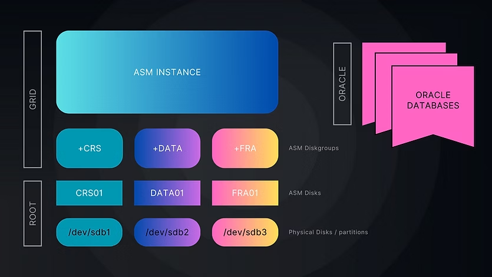
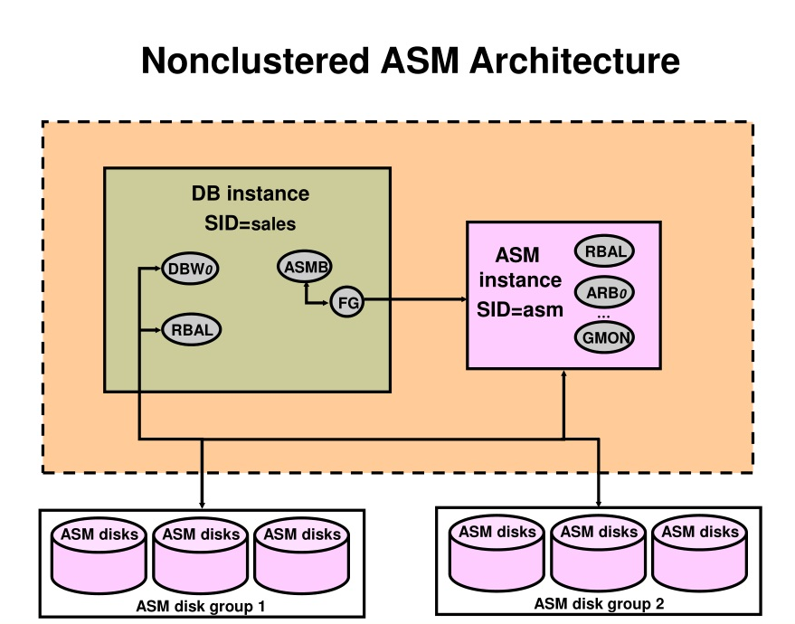
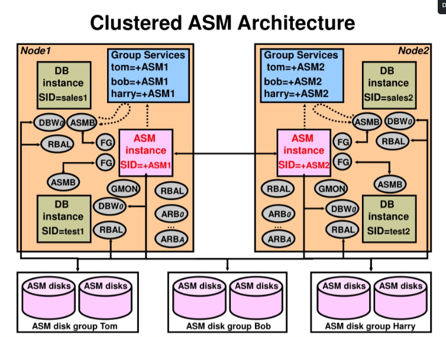
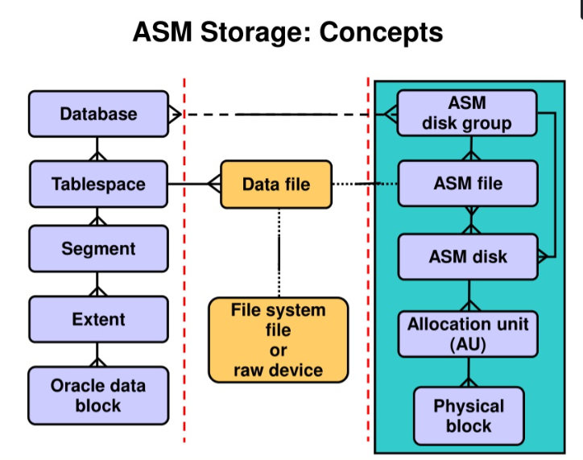

## Oracle-ASM-Architecture: 

Oracle ASM (Automatic Storage Management) is a volume manager and file system for Oracle database files, specifically designed to simplify storage management. It is tightly integrated with the Oracle Database and offers high performance, scalability, and availability.


### ASM Instance:

Oracle ASM instance is built on same architecture as Oracle Instance. There are special ASM background processes that are introduce inside Oracle database to communicate with ASM instance and diskgroups. The only difference is an Oracle database hosts your database and Oracle ASM hosts database files. 





- **Physical Disks / Partitions**: This is your hardware storage which provides **raw storage** capacity. Each physical disk / partition is mapped to a single ASM disk.

- **ASM Disks**: These are disks that **ASM can easily identify and you can attach ASM disks to ASM Diskgroups**. One ASM Disk can be attached to one and only one ASM DIskgroup.

- **ASM Diskgroups**: These are **collection of one or more ASM disks** that acts as storage location for your database files. All diskgroup name start with `+` sign: `+CRS`, `+DATA`, `+FRA` etc.

- **ASM Instance**: It's the gateway through which Oracle databases can read/write to database files stored on ASM Diskgroups.


#### Diagram (Text Representation):

```
           +---------------------+
           |  Oracle Database    |
           +---------+-----------+
                     |
                     v
          +----------------------+
          |     ASM Instance     |
          |  (metadata & control)|
          +--+----+----+----+----+
             |    |    |    |
            RBAL ARBn GMON MARK ...
             |
             v
      +-------------------+
      |  ASM Disk Groups  |
      +--------+----------+
               |
       +-------+--------+
       |       |        |
    Disk1   Disk2    Disk3  ...

```


#### ASM Background Process:

The following background processes are an integral part of Automatic Storage Management. Oracle database that uses ASM disks, two new background processes exists: 

- **ASMB or ASM Bridge** : performs communication between the database and the ASM instance.
- **RBAL** : performs the opening and closing of the disks in the disk groups on behalf of Oracle database and coordinates rebalance activity.

Some of the more important ASM background processes:
- **ARBn or Actual Rebalancer** : They perform the actual rebalancing activities. The number of `ARBn` processes depends on the ASM_POWER_LIMIT init parameter.
- **GMON** : This process is responsible for managing the disk-level activities (drop/offline) and advancing diskgroup compatibility.
- **MARK** : The Mark **Allocation Unit (AU) for Resync Koordinator** (MARK) process coordinates the updates to the Staleness Registry when the disks go offline. This process runs in the RDBMS instance and is started only when disks go offline in ASM redundancy diskgroups. **MARK** is ASM allocation units as stale following a missed write to an offline disk. This essentially tracks which extents require resync for offline disks.
- **KATE** : Konductor process, used for online disk operations, particularly when offlined disks are brought online. 
- **DBWR** : This process manages the SGA buffer cache in the ASM instance. DBWR writes out dirty buffers (changed metadata buffers) from the ASM
buffer cache to disk.
- **LGWR** : The LGWR process maintains the ASM Active Change Directory(ACD) buffers from the ASM instance and flushes ACD change records to disk.
- **PMON** : The process monitor process.


### Non/clustered ASM Architecture:






### ASM Disk:

Disks in ASM can be physical disks, LUNs (logical unit numbers) representing disks. 

- A **raw disk or partition** used by ASM to store database files.
- Can be entire disks, or partitions, LUNs with no file system on top.
- Network-attached files (NFS)


#### Create ASM Diskgroups:

```
oracleasm createdisk DATA_DISK01 /dev/sdb1
oracleasm createdisk DATA_DISK02 /dev/sdc1
```


### ASM Disk Group:

A disk group is a logical collection of disks managed by ASM. Disks in a disk group are automatically striped and mirrored to balance the load and ensure data redundancy. 

- A **collection of ASM disks**.
- Acts as a logical volume: Database files are placed into disk groups.
- ASM manages striping, mirroring, and load balancing.
- Types of redundancy:
    - **External**: to not use Oracle ASM mirroring (configure hardware RAID for redundancy).
    - **Normal**: 2-way mirroring.
    - **High**: 3-way mirroring.


### ASM Allocation Units: 

Every Oracle ASM disk is divided into allocation units (AU).

- ASM divides each disk into allocation units (AU), which are the smallest unit of storage managed by ASM. By default, an allocation unit is 1 MB in size. 

- When a file is created in ASM, it is divided into extents, which are stored in allocation units across the disks in the disk group. ASM automatically manages the placement and distribution of these extents to balance I/O loads and optimize performance. 

- An allocation unit is the fundamental unit of allocation within a disk group. A file extent consists of one or more allocation units. An Oracle ASM file consists of one or more file extents.

- When you create a disk group, you can set the Oracle ASM allocation unit size with the AU_SIZE disk group attribute. The **values can be 1, 2, 4, 8, 16, 32, or 64 MB**, depending on the specific disk group compatibility level. Larger AU sizes typically provide performance advantages for data warehouse applications that use large sequential reads.





### ASM Files:
Files that are stored in Oracle ASM disk groups are called Oracle ASM files.

You can store the various file types in Oracle ASM disk groups, including:

- Control files
- Data files, temporary data files, and data file copies
- SPFILEs
- Online redo logs, archive logs, and Flashback logs
- RMAN backups
- Disaster recovery configurations
- Change tracking bitmaps
- Data Pump dumpsets


### License:
This project is licensed under the MIT License.


