## ASM: Oracle 19c Database Installation

Installing Oracle 19c using ASM (**Automatic Storage Management**) is a multi-step process that involves setting up ASM via Grid Infrastructure and then installing the Oracle Database.


### Prerequisites:
- Oracle Linux 7 or 8 / RHEL compatible
- Minimum 8GB RAM
- Set hostname and IP (static)
- Sufficient disk space for Grid Infrastructure (GI), Oracle Home, and ASM disks 
- Set up the environment variables for the OS Accounts: `grid` and `oracle` 


#### Environment:

_Set Hostname:_
```
hostnamectl set-hostname asm01
```


_Set Hosts Entry:_
```
vim /etc/hosts

192.168.10.191		asm01.technbd.net        asm01
```


### Add Raw Disks:

1. Minimum: 1 Disk: If you just want to get started (e.g. for learning or dev): You can use only one raw disk and create a single `+DATA` disk group on it.
2. Recommended: 2 Disks or More: Basic Production-like Setup 
  - `/dev/sdb` :	`+DATA` (Database files) 
  - `/dev/sdc` :	`+FRA` (Backups/Archivelogs)
3. Advanced (Optional):
  - `/dev/sdb` :	`+DATA`
  - `/dev/sdc` :	`+FRA`
  - `/dev/sdd` :	`+GRID` (if using OCR/voting in ASM)


#### Disks Summary:
```
/dev/sdb	20G for ASM DISK
/dev/sdc	20G for ASM DISK
/dev/sdd	40G for orabackup
```


_To add two/three Virtual Hard Disk (**SCSI**) to your Linux machines:_
```
lsblk

NAME        MAJ:MIN RM  SIZE RO TYPE MOUNTPOINT
sda           8:0    0  100G  0 disk
├─sda1        8:1    0    2M  0 part
├─sda2        8:2    0    2G  0 part /boot
└─sda3        8:3    0   98G  0 part
  ├─ol-root 252:0    0   82G  0 lvm  /
  └─ol-swap 252:1    0   16G  0 lvm  [SWAP]

sdb           8:16   0   20G  0 disk
sdc           8:32   0   20G  0 disk
sdd           8:48   0   20G  0 disk
sr0          11:0    1 1024M  0 rom
```


```
lsscsi -s

[1:0:0:0]    cd/dvd  NECVMWar VMware IDE CDR10 1.00  /dev/sr0   1.07GB
[2:0:0:0]    disk    VMware,  VMware Virtual S 1.0   /dev/sda    107GB
[3:0:0:0]    disk    TrueNAS  iSCSI Disk       0123  /dev/sdb   21.4GB
[4:0:0:1]    disk    TrueNAS  iSCSI Disk       0123  /dev/sdc   21.4GB
[5:0:0:2]    disk    TrueNAS  iSCSI Disk       0123  /dev/sdd   21.4GB
```


```
ll /dev/disk/by-path/

lrwxrwxrwx 1 root root  9 Aug  5 03:13 ip-192.168.10.194:3260-iscsi-iqn.2025-08.net.technbd:asm01:asm01-lun1-lun-0 -> ../../sdb
lrwxrwxrwx 1 root root  9 Aug  5 03:14 ip-192.168.10.194:3260-iscsi-iqn.2025-08.net.technbd:asm01:asm01-lun2-lun-1 -> ../../sdc
lrwxrwxrwx 1 root root  9 Aug  5 03:14 ip-192.168.10.194:3260-iscsi-iqn.2025-08.net.technbd:asm01:asm01-lun3-lun-2 -> ../../sdd
lrwxrwxrwx 1 root root  9 Aug  5 03:10 pci-0000:00:07.1-ata-2 -> ../../sr0
lrwxrwxrwx 1 root root  9 Aug  5 03:10 pci-0000:00:10.0-scsi-0:0:0:0 -> ../../sda
lrwxrwxrwx 1 root root 10 Aug  5 03:10 pci-0000:00:10.0-scsi-0:0:0:0-part1 -> ../../sda1
lrwxrwxrwx 1 root root 10 Aug  5 03:10 pci-0000:00:10.0-scsi-0:0:0:0-part2 -> ../../sda2
lrwxrwxrwx 1 root root 10 Aug  5 03:10 pci-0000:00:10.0-scsi-0:0:0:0-part3 -> ../../sda3
```


### Host Architecture:


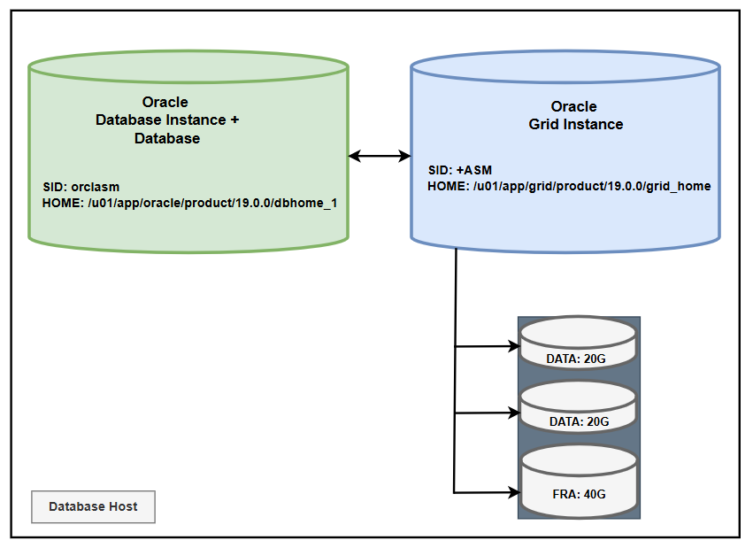


---
---


### Install Required Packages:

#### Automatic Setup:

```
yum install -y oracle-database-preinstall-19c

yum update -y

yum install -y unixODBC
```


_Create limitation in security folder for grid user:_
```
cp /etc/security/limits.d/oracle-database-preinstall-19c.conf /etc/security/limits.d/grid-database-preinstall-19c.conf
```


_Rename `oracle` to `grid` user in this file `grid-database-preinstall-19c.conf`_
``` 
vim /etc/security/limits.d/grid-database-preinstall-19c.conf


:%s/oracle/grid/g
```


#### Check user and groups: 

```
cat /etc/passwd | grep oracle

oracle:x:54321:54321::/home/oracle:/bin/bash
```


```
cat /etc/group | grep oracle

oinstall:x:54321:oracle
dba:x:54322:oracle
oper:x:54323:oracle
backupdba:x:54324:oracle
dgdba:x:54325:oracle
kmdba:x:54326:oracle
racdba:x:54330:oracle
```


```
id oracle

uid=54321(oracle) gid=54321(oinstall) groups=54321(oinstall),54322(dba),54323(oper),54324(backupdba),54325(dgdba),54326(kmdba),54330(racdba)
```


#### Create the new groups and users: 

```
groupadd -g 54321 oinstall
groupadd -g 54322 dba
groupadd -g 54323 oper
groupadd -g 54324 backupdba
groupadd -g 54325 dgdba
groupadd -g 54326 kmdba

### Add this groups: 
groupadd -g 54327 asmdba
groupadd -g 54328 asmoper
groupadd -g 54329 asmadmin

groupadd -g 54330 racdba
```


```
usermod -g oinstall -G dba,oper,backupdba,dgdba,asmdba,asmoper,asmadmin,kmdba,racdba oracle
```


```
useradd -g oinstall -G dba,oper,backupdba,dgdba,asmdba,asmoper,asmadmin,kmdba,racdba grid
```


```
passwd oracle
```


```
passwd grid
```


### Create the directories (Create Manually):


_Create the Directories for Oracle Database installation:_

```
mkdir -p /u01/app/oracle/product/19.0.0/dbhome_1
chown -R oracle:oinstall /u01
```


```
//mkdir -p /u01/app/oraInventory
//chown -R grid:oinstall /u01/app/oraInventory
```


_Create the Directories for Oracle **Grid** installation:_

```
mkdir -p /u01/app/grid/product/19.0.0/grid_home
chown -R grid:oinstall /u01/app/grid
```


```
chmod -R 775 /u01
```


```
ll /u01/app/

drwxrwxr-x 3 grid   oinstall 21 Aug  5 00:55 grid
drwxrwxr-x 3 oracle oinstall 21 Aug  5 00:54 oracle
```


### Create Oracle Environment File for OS Accounts: `grid` & `oracle`:


_For `oracle` user:_
```
vim ~/.bash_profile


### Add for oracle user:
export TMP=/tmp
export TMPDIR=$TMP

#export ORACLE_HOSTNAME=orclasm.local

export ORACLE_BASE=/u01/app/oracle
export ORACLE_HOME=$ORACLE_BASE/product/19.0.0/dbhome_1

## Oracle SID (instance name)
export ORACLE_SID=orclasm      ## <-- Ensure this matches your actual DB SID
export ORACLE_UNQNAME=orclasm
export PDB_NAME=pdb1

export NLS_DATE_FORMAT="DD-MON-YYYY HH24:MI:SS"
export TNS_ADMIN=$ORACLE_HOME/network/admin

export LD_LIBRARY_PATH=$ORACLE_HOME/lib:/lib:/usr/lib
export CLASSPATH=$ORACLE_HOME/jlib:$ORACLE_HOME/rdbms/jlib

## Add Oracle to PATH:
export PATH=$ORACLE_HOME/bin:$PATH:$HOME/.local/bin
```


```
source ~/.bash_profile
```


```
env | grep -i oracle
```


```
echo $ORACLE_HOME
echo $ORACLE_SID
echo $ORACLE_UNQNAME
```


_For `grid` user:_
```
vim ~/.bash_profile


### Add for grid user:
export TMP=/tmp
export TMPDIR=$TMP

export ORACLE_BASE=/u01/app/grid
export ORACLE_HOME=$ORACLE_BASE/product/19.0.0/grid_home

export ORACLE_SID=+ASM

export TNS_ADMIN=$ORACLE_HOME/network/admin
export ORACLE_TERM=xterm

export PATH=$ORACLE_HOME/bin:$PATH:$HOME/.local/bin

umask 022
```


```
source ~/.bash_profile
```


```
echo $ORACLE_HOME
echo $ORACLE_SID
```


---
---


### Install ASM Packages:

#### Oracle ASMLib Downloads/Install for Oracle Linux 8: 

**ASMLib**, short for "Automatic Storage Management Library," is a support library provided by Oracle for managing Oracle ASM (Automatic Storage Management) on Linux systems.

> [!NOTE]  
> All ASMLib installations require the `oracleasmlib` and `oracleasm-support` packages.

- The `oracleasm-support` package can be downloaded from the **Unbreakable Linux Network** (ULN) if you have an active support subscription, or from `https://yum.oracle.com` if you do not.
- The oracleasm kernel driver required is included in the **Unbreakable Enterprise Kernel version 6**. For **Unbreakable Enterprise Kernel version 7** and newer, no driver is required to use **ASMLib**.


```
yum list available | grep oracleasm
```


```
yum config-manager --enable ol8_addons

yum repolist enabled | grep ol8
```


```
yum search -y oracleasm-support

yum install -y oracleasm-support
```


```
yum install -y kmod-redhat-oracleasm     ### Oracle Linux 8.x
```


```
yum list installed | grep oracleasm


kmod-redhat-oracleasm.x86_64                       8:2.0.8-18.2.0.1.el8_10             @ol8_baseos_latest
oracleasm-support.x86_64                           3.1.0-10.el8                        @ol8_addons
```


_Oracle Linux 8.9 not working (Install manually using `.rpm`):_
``` 
//yum install -y oracleasmlib 
```


Or,

```
wget https://download.oracle.com/otn_software/asmlib/oracleasmlib-2.0.17-1.el8.x86_64.rpm

//wget https://yum.oracle.com/repo/OracleLinux/OL8/addons/x86_64/getPackage/oracleasm-support-2.1.12-1.el8.x86_64.rpm


rpm -Uvh oracleasmlib-2.0.17-1.el8.x86_64.rpm

//rpm -Uvh oracleasm-support-2.1.12-1.el8.x86_64.rpm


Or,

yum install -y https://download.oracle.com/otn_software/asmlib/oracleasmlib-2.0.17-1.el8.x86_64.rpm

//yum install -y https://yum.oracle.com/repo/OracleLinux/OL8/addons/x86_64/getPackage/oracleasm-support-2.1.12-1.el8.x86_64.rpm
```


```
rpm -qa | grep oracleasm

kmod-redhat-oracleasm-2.0.8-18.2.0.1.el8_10.x86_64
oracleasm-support-3.1.0-10.el8.x86_64
oracleasmlib-2.0.17-1.el8.x86_64
```


_For Oracle Linux 7.9:_
```
yum install -y oracleasm-support kmod-oracleasm

wget https://download.oracle.com/otn_software/asmlib/oracleasmlib-2.0.12-1.el7.x86_64.rpm
wget https://yum.oracle.com/repo/OracleLinux/OL7/latest/x86_64/getPackage/oracleasm-support-2.1.11-2.el7.x86_64.rpm

yum install -y https://download.oracle.com/otn_software/asmlib/oracleasmlib-2.0.12-1.el7.x86_64.rpm
```


```
rpm -qa | grep oracleasm

kmod-oracleasm-2.0.8-28.0.1.el7.x86_64
oracleasm-support-2.1.11-2.el7.x86_64
oracleasmlib-2.0.12-1.el7.x86_64
```


```
yum remove oracleasmlib oracleasm-support kmod-oracleasm kmod-redhat-oracleasm
```


#### Configure Oracle ASMLib:


_Configure ASM kernel module:_
```
oracleasm configure -i


### Output: 
Configuring the Oracle ASM system service.

This will configure the on-boot properties of the Oracle ASM system
service.  The following questions will determine whether the service
is started on boot and what permissions it will have.  The current
values will be shown in brackets ('[]').  Hitting <ENTER> without
typing an answer will keep that current value.  Ctrl-C will abort.

Default user to own the ASM disk devices []: grid

Default group to own the ASM disk devices []: oinstall

Start Oracle ASM system service on boot (y/n) [y]: y

Scan for Oracle ASM disks when starting the oracleasm service (y/n) [y]: y

Maximum number of ASM disks that can be used on system [2048]:

Enable iofilter if kernel supports it (y/n) [y]: y


Writing Oracle ASM system service configuration: done

Configuration changes only come into effect after the Oracle ASM
system service is restarted.  Please run 'systemctl restart oracleasm'
after making changes.

WARNING: All of your Oracle and ASM instances must be stopped prior
to restarting the oracleasm service.
```


```
systemctl status oracleasm
systemctl start oracleasm
```


_Load the `oracleasm` kernel module:_
```
lsmod | grep oracleasm
```


```
//modprobe oracleasm
```


```
/usr/sbin/oracleasm init


### Output: 
Mounting oracleasm driver filesystem: Not applicable with kernel 5.15.0
Reloading disk partitions: done
Cleaning any stale ASM disks...
Setting up iofilter map for ASM disks: done
Scanning system for ASM disks...
Disk scan successful
```


```
oracleasm status
```


### Create ASM disks:

Oracle recommends: Use entire, unpartitioned block devices for ASM (e.g., `/dev/sdb`, `/dev/sdc`), not partitions like `/dev/sdb1`.


#### Create partitions for the disks: 

```
lsblk -d -o NAME,SIZE,TYPE | grep disk

sda   100G disk
sdb    20G disk
sdc    20G disk
sdd    20G disk
```


_Partition the Disks:_

```
fdisk /dev/sdb


Welcome to fdisk (util-linux 2.32.1).
Changes will remain in memory only, until you decide to write them.
Be careful before using the write command.

Device does not contain a recognized partition table.
Created a new DOS disklabel with disk identifier 0xe6d9615c.

Command (m for help): n
Partition type
   p   primary (0 primary, 0 extended, 4 free)
   e   extended (container for logical partitions)
Select (default p): p
Partition number (1-4, default 1):
First sector (16384-41943071, default 16384):
Last sector, +sectors or +size{K,M,G,T,P} (16384-41943071, default 41943071):

Created a new partition 1 of type 'Linux' and of size 20 GiB.

Command (m for help): w
The partition table has been altered.
Calling ioctl() to re-read partition table.
Syncing disks.
```


```
fdisk /dev/sdc


Welcome to fdisk (util-linux 2.32.1).
Changes will remain in memory only, until you decide to write them.
Be careful before using the write command.

Device does not contain a recognized partition table.
Created a new DOS disklabel with disk identifier 0x3df643d5.

Command (m for help): n
Partition type
   p   primary (0 primary, 0 extended, 4 free)
   e   extended (container for logical partitions)
Select (default p): p
Partition number (1-4, default 1):
First sector (16384-41943071, default 16384):
Last sector, +sectors or +size{K,M,G,T,P} (16384-41943071, default 41943071):

Created a new partition 1 of type 'Linux' and of size 20 GiB.

Command (m for help): w
The partition table has been altered.
Calling ioctl() to re-read partition table.
Syncing disks.
```


```
lsblk


NAME        MAJ:MIN RM  SIZE RO TYPE MOUNTPOINT
sda           8:0    0  100G  0 disk
├─sda1        8:1    0    2M  0 part
├─sda2        8:2    0    2G  0 part /boot
└─sda3        8:3    0   98G  0 part
  ├─ol-root 252:0    0   82G  0 lvm  /
  └─ol-swap 252:1    0   16G  0 lvm  [SWAP]
sdb           8:16   0   20G  0 disk
└─sdb1        8:17   0   20G  0 part
sdc           8:32   0   20G  0 disk
└─sdc1        8:33   0   20G  0 part
sdd           8:48   0   20G  0 disk
sr0          11:0    1 1024M  0 rom
```


#### Create DATA disks: (`root` user)


```
oracleasm createdisk DISK01 /dev/sdb1
oracleasm createdisk DISK02 /dev/sdc1

oracleasm createdisk DISK03 /dev/sdd1


### Output: 
Writing disk header: done
Instantiating disk: done
```


Or,

```
oracleasm createdisk --force DISK01 /dev/sdb
oracleasm createdisk --force DISK01 /dev/sdc
```


```
oracleasm querydisk /dev/sdb1


Device "/dev/sdb1" is marked an ASM disk with the label "DISK01"
```


_Check from `root` or `grid` users:_
```
oracleasm listdisks

### Output: 
DISK01
DISK02
DISK03
```


```
ll /dev/oracleasm/disks/

brw-rw---- 1 grid oinstall 8, 17 Aug  5 23:16 DISK01
brw-rw---- 1 grid oinstall 8, 33 Aug  5 23:16 DISK02
brw-rw---- 1 grid oinstall 8, 49 Aug  5 23:16 DISK03
```


---
---


## Installation:


### Download/Upload oracle 19c software:
Download Oracle 19c software (https://www.oracle.com/apac/database/technologies/oracle19c-linux-downloads.html) to oracle home directory:


```
su - grid
cd $ORACLE_HOME

unzip LINUX.X64_193000_grid_home.zip
```


```
su - oracle
cd $ORACLE_HOME

unzip LINUX.X64_193000_db_home.zip
```


### Install Oracle 19c Grid Infrastructure:

- `grid` user oracle ASM owner. 
- ASM instance alway **read only** or **mount** mode
- Database instance and Database relationship manage by background processes.
- Grid ASM instance + Database instance and Database relationship manage by background processes. 


_Install `cvuqdisk` to run as `root` users:_

```
export CV_ASSUME_DISTID=OEL7.9
export CVUQDISK_GRP=oinstall


cd /u01/app/grid/product/19.0.0/grid_home
rpm -ivh cv/rpm/cvuqdisk-1.0.10-1.rpm
```


```
su - grid
```


```
./gridSetup.sh
```

1. Configuration Option: 
	- [ ] Configure Oracle Grid Infrastructure for a New Cluster
  	- [✔] Configure Oracle Grid Infrastructure for a Standalone Server (Oracle Restart)
  	- [ ] Upgrade Oracle Grid Infrastructure
  	- Next

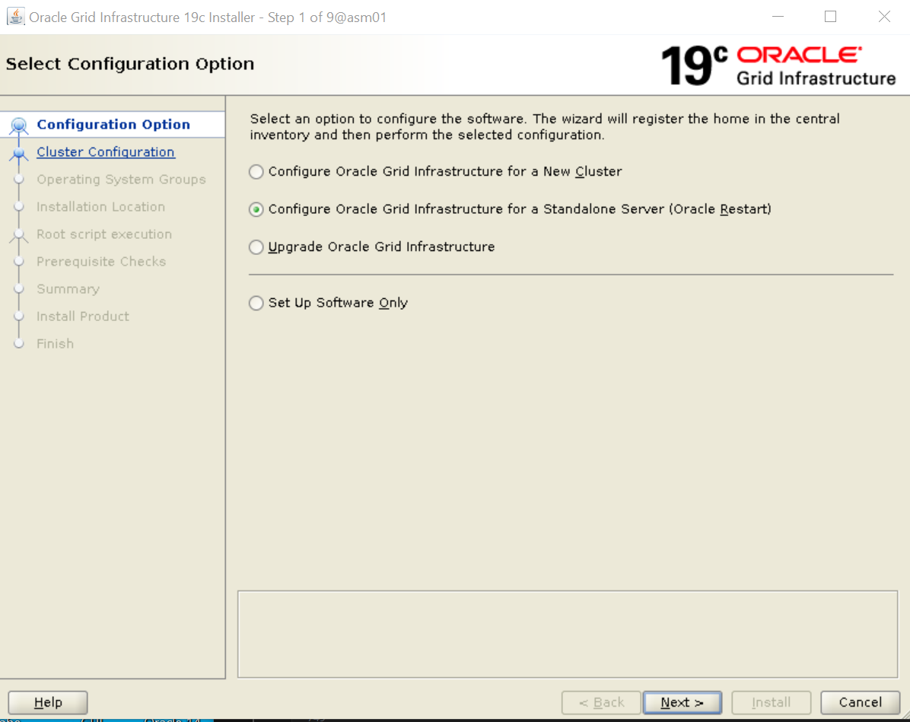


2. Create ASM Disk Group:
	- Disk group name: `DATA` [means: +DATA]
  	- Redundancy: `Normal` 
  	- Allocation Unit Size: `4 MB`
  	- Select Disks:
    	- Change Discovery Path... : `/dev/oracleasm/disks/*`
      	- [✔] /dev/oracleasm/disks/DISK01
      	- [✔] /dev/oracleasm/disks/DISK02
      	- [ ] /dev/oracleasm/disks/DISK03

  	- [ ] Configure Oracle ASM Filter Driver
  	- Next

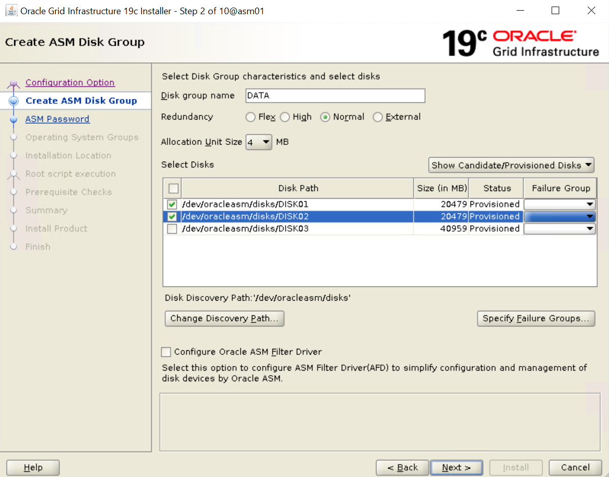


3. ASM Password:
	- [ ] Use different passwords for these accounts
  	- [✔]  Use same passwords for these accounts
    	- Specify Password: asm12345
  	- Next


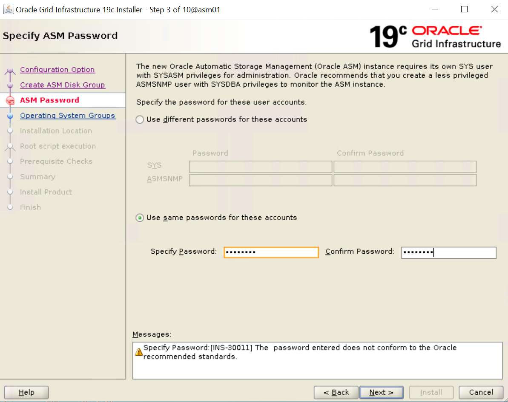


4. Management Options: 
	- Next 

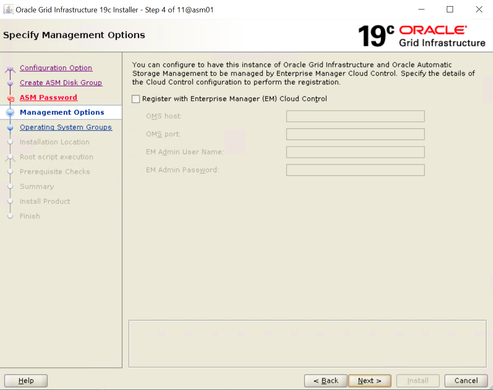


5. Operating System Groups:
	- Oracle ASM Administrator (OSASM) Group: `asmadmin`
	- Oracle ASM DBA (OSDBA for ASM) Group: `asmdba`
	- Oracle ASM Operator (OSOPER for ASM) Group (Optional): `asmoper`
	- Next

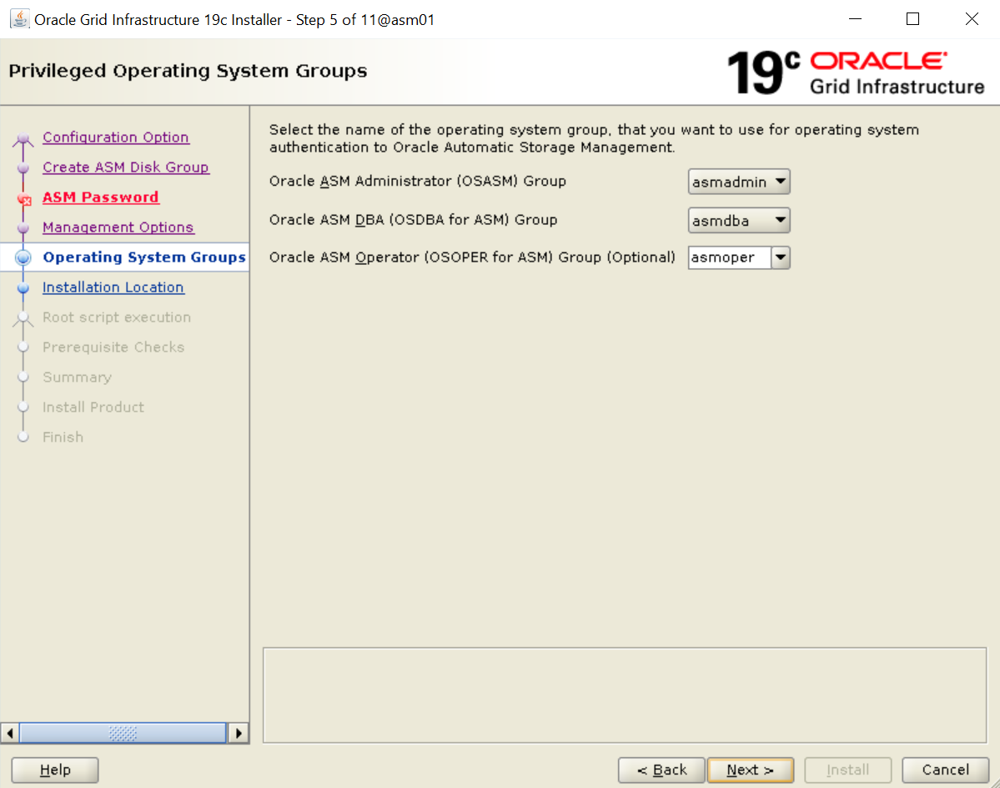


6. Installation Location:
	- Oracle base: `/u01/app/grid`
	- Next


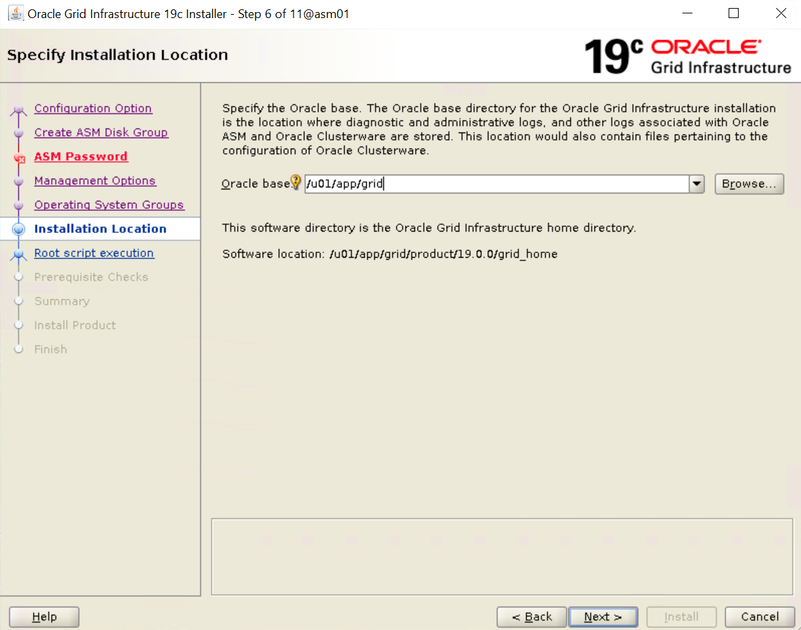


7. Create Inventory: 
	- Inventory Directory: `/u01/app/oraInventory`
	- Next 

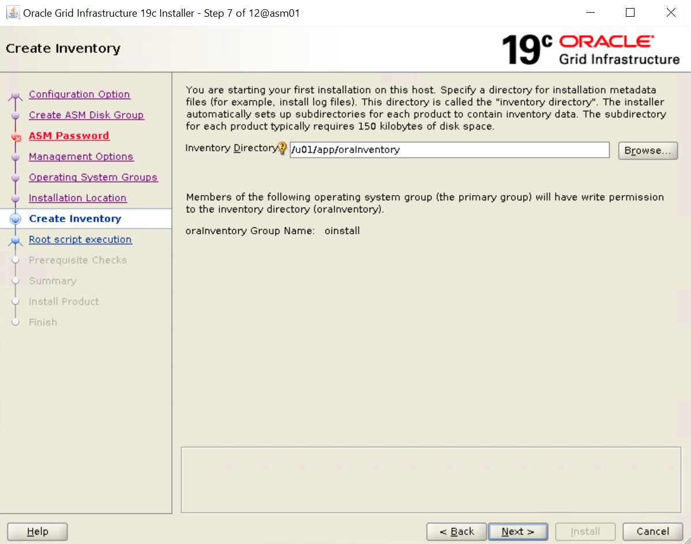


8. Root script execution:
	- Next 

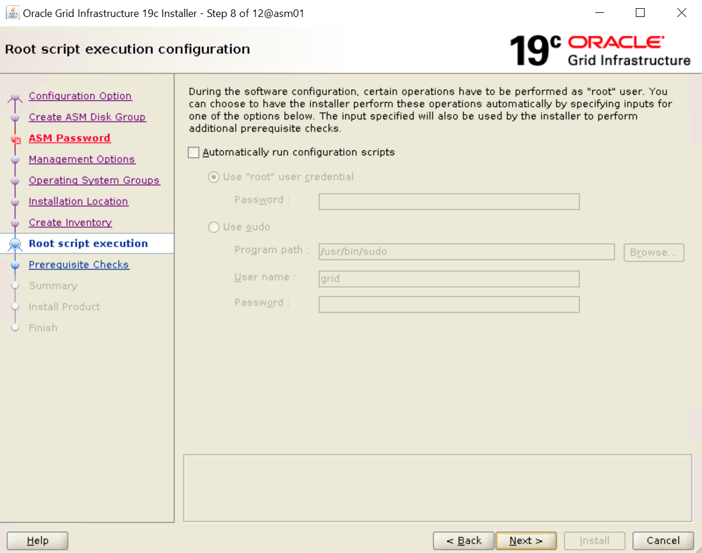


9. Prerequisite Checks:
	- Next 

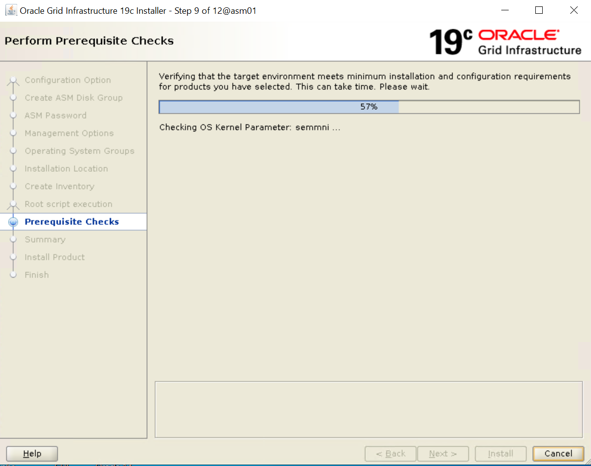


10. Summary:
	- Install 

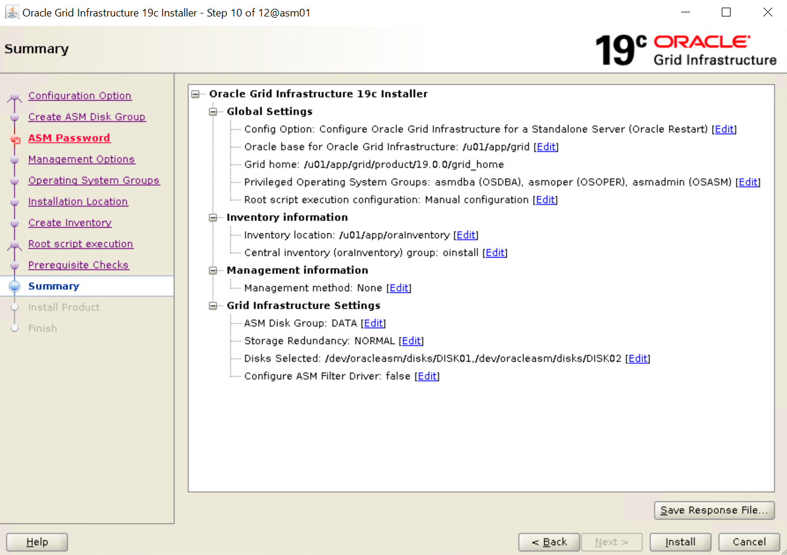


11. Install Product: 


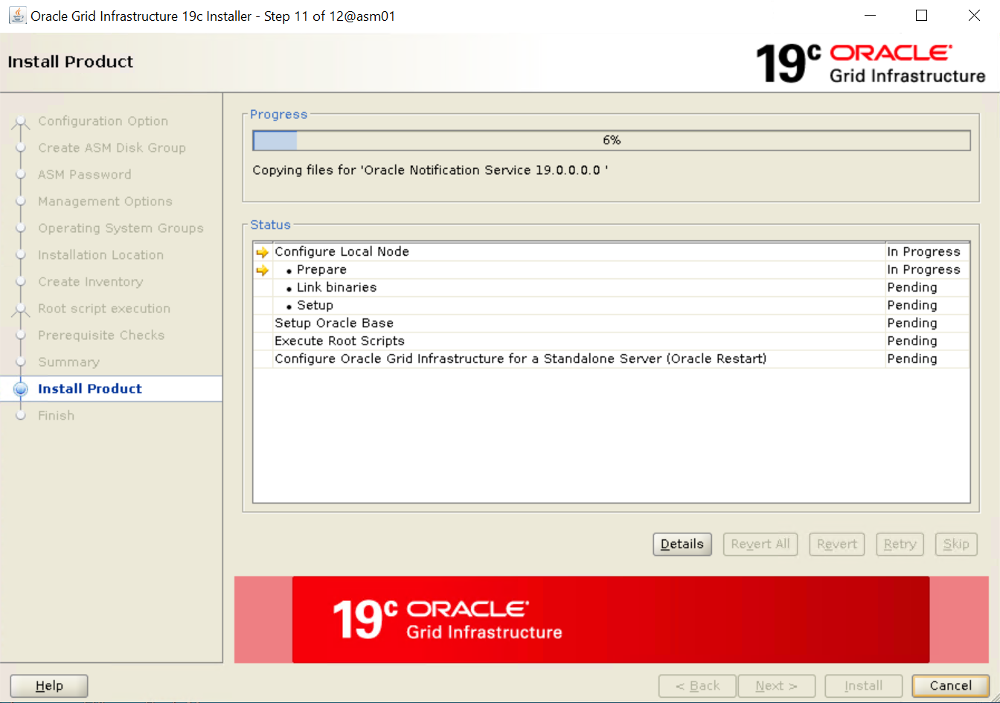


```
/u01/app/oraInventory/orainstRoot.sh


### Output: 
Changing permissions of /u01/app/oraInventory.
Adding read,write permissions for group.
Removing read,write,execute permissions for world.

Changing groupname of /u01/app/oraInventory to oinstall.
The execution of the script is complete.
```


```
/u01/app/grid/product/19.0.0/grid_home/root.sh


### Output: 
Performing root user operation.

The following environment variables are set as:
    ORACLE_OWNER= grid
    ORACLE_HOME=  /u01/app/grid/product/19.0.0/grid_home

Enter the full pathname of the local bin directory: [/usr/local/bin]:
   Copying dbhome to /usr/local/bin ...
   Copying oraenv to /usr/local/bin ...
   Copying coraenv to /usr/local/bin ...


Creating /etc/oratab file...
Entries will be added to the /etc/oratab file as needed by
Database Configuration Assistant when a database is created
Finished running generic part of root script.
Now product-specific root actions will be performed.
Using configuration parameter file: /u01/app/grid/product/19.0.0/grid_home/crs/install/crsconfig_params
The log of current session can be found at:
  /u01/app/grid/crsdata/asm01/crsconfig/roothas_2025-08-06_00-01-47AM.log
2025/08/06 00:01:50 CLSRSC-363: User ignored prerequisites during installation
LOCAL ADD MODE
Creating OCR keys for user 'grid', privgrp 'oinstall'..
Operation successful.
LOCAL ONLY MODE
Successfully accumulated necessary OCR keys.
Creating OCR keys for user 'root', privgrp 'root'..
Operation successful.
CRS-4664: Node asm01 successfully pinned.
2025/08/06 00:02:00 CLSRSC-330: Adding Clusterware entries to file 'oracle-ohasd.service'

asm01     2025/08/06 00:02:38     /u01/app/grid/crsdata/asm01/olr/backup_20250806_000238.olr     724960844
2025/08/06 00:02:38 CLSRSC-327: Successfully configured Oracle Restart for a standalone server

```


12. Finish:
	- Close 

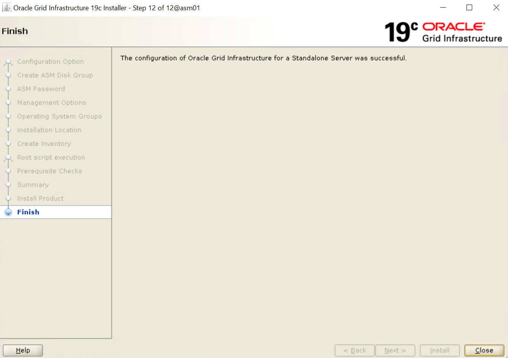


#### Verify: 

```
ps -ef | grep pmon

grid     17447     1  0 00:04 ?        00:00:02 asm_pmon_+ASM
```


```
ps -ef | grep smon

grid     17485     1  0 00:04 ?        00:00:00 asm_smon_+ASM
```


```
crsctl check has

CRS-4638: Oracle High Availability Services is online
```


```
crsctl status res -t
crsctl status resource -t


--------------------------------------------------------------------------------
Name           Target  State        Server                   State details
--------------------------------------------------------------------------------
Local Resources
--------------------------------------------------------------------------------
ora.DATA.dg
               ONLINE  ONLINE       asm01                    STABLE
ora.LISTENER.lsnr
               ONLINE  ONLINE       asm01                    STABLE
ora.asm
               ONLINE  ONLINE       asm01                    Started,STABLE
ora.ons
               OFFLINE OFFLINE      asm01                    STABLE
--------------------------------------------------------------------------------
Cluster Resources
--------------------------------------------------------------------------------
ora.cssd
      1        ONLINE  ONLINE       asm01                    STABLE
ora.diskmon
      1        OFFLINE OFFLINE                               STABLE
ora.evmd
      1        ONLINE  ONLINE       asm01                    STABLE
--------------------------------------------------------------------------------
```


```
asmcmd -p


ASMCMD [+] > ls
DATA/

ASMCMD [+] > cd DATA

ASMCMD [+DATA] > ls
ASM/
orapwasm

ASMCMD [+DATA] > cd ASM/

ASMCMD [+DATA/ASM] > ls
ASMPARAMETERFILE/
PASSWORD/

ASMCMD [+DATA/ASM] > lsdg
State    Type    Rebal  Sector  Logical_Sector  Block       AU  Total_MB  Free_MB  Req_mir_free_MB  Usable_file_MB  Offline_disks  Voting_files  Name
MOUNTED  NORMAL  N         512             512   4096  4194304     40952    40728                0           20364              0             N  DATA/
ASMCMD [+DATA/ASM] >
```


```
sqlplus /nolog

conn /as sysasm
```


```
show parameter ins


NAME                                 TYPE        VALUE
------------------------------------ ----------- ------------------------------
cluster_database_instances           integer     1
instance_abort_delay_time            integer     0
instance_name                        string      +ASM
instance_number                      integer     1
instance_type                        string      ASM
```


```
select INSTANCE_NAME, STATUS, DATABASE_STATUS, INSTANCE_MODE from v$instance;

INSTANCE_NAME    STATUS       DATABASE_STATUS   INSTANCE_MO
---------------- ------------ ----------------- -----------
+ASM             STARTED      ACTIVE            REGULAR
```


#### Create ASM disk groups (GUI): 


```
asmca
```


1. Go to: ASM - Disk Groups:
	- DATA 

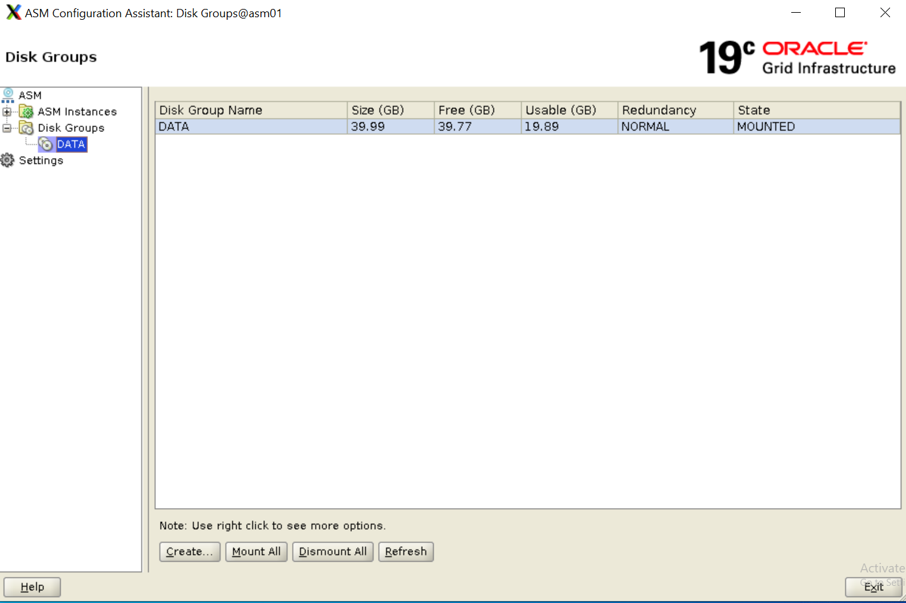


2. `Create` click - 
	- Disk group name: `FRA`
	- Redundancy: `External (None)`  [For one Disk] 
	- Allocation Unit Size (MB): `4`
	- [✔] Show Eligible:
    	- [✔] /dev/oracleasm/disks/DISK03
	- click `OK`


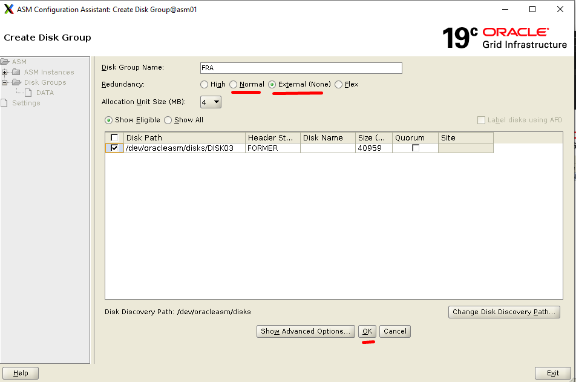  

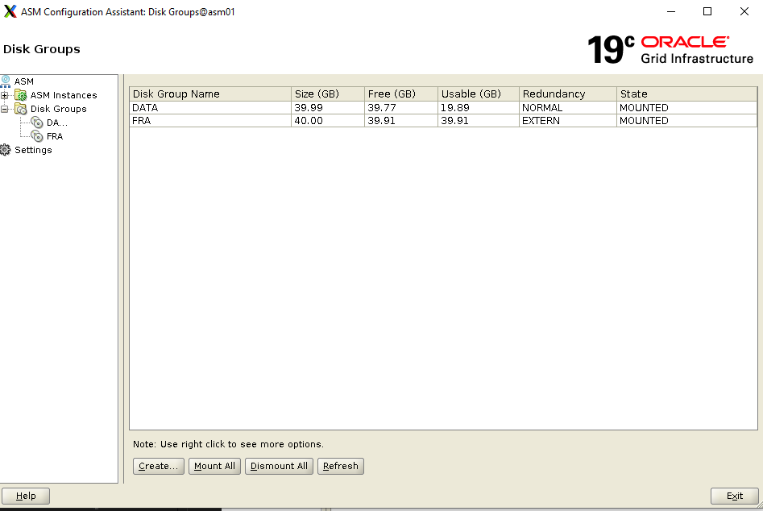


_Verify:_
```
asmcmd -p

ASMCMD [+] > ls
DATA/
FRA/
```


### Install Oracle 19c Database:


#### Install Software Only (GUI):

```
su - oracle
```


```
export CV_ASSUME_DISTID=OEL7.9
```


```
./runInstaller
```

1. Configuration Option: 
	- [ ] Create and configure a single instance database.  [-> Install Engine and Database]
	- [✔] Set Up Software Only   [-> Install only Engine]
	- Next


2. Database Installation Options: 
	- [✔] Single instance database installation
	- [ ] Oracle RAC clusters database installation
	- Next


3. Database Edition: 
	- [✔] Enterprise Edition
	- [ ] Standard Edition 2
	- Next


4. Installation Location: 
	- Oracle base: `/u01/app/oracle`
	- Next


5. Create Inventory: 
	- Inventory Directory: `/u01/app/oraInventory`
	- oraInventory Group Name: `oinstall`
	- Next:


6. Operating System Groups: `Note`: All are select `oinstall` no issues, but RAC install different groups. 
	- Database Administrator (OSDBA) group: `oinstall`
	- Database Operator (OSOPER) group (Optional): `oinstall`
	- Database Backup Recovery (OSBACKUPDBA) group: `oinstall`
	- Data Guard Administrative (OSDGDBA) group: `oinstall`
	- Encryption key Management Administrative (OSMKDBA) group: `oinstall`
	- RAC cluster Administrative (OSRACDBA) group: `oinstall`
	- Next


7. Root script execution: 
	- [ ] Automatically run configuration scripts
	- Next


8. Prerequisite Checks:


9. Summary: 
	- click `Install`


10. Install Product: 

_Run the 02 scripts when prompted `root` user:_
```
/u01/app/oraInventory/orainstRoot.sh
```


```
/u01/app/oracle/product/19.0.0/dbhome_1/root.sh
```


10. Finish: 
	- The registration of Oracle database was successful. 
	- Close [Finish]


### Create/Install 19c Database using `dbca` (GUI):


#### Typical configuration and Install: 


```
dbca
```


1. Database Operation:
	- [✔] Create a database
	- Next


2. Creation Mode: 
	- [✔] Typical configuration:
		- Global database name: `orclasm`
		- Storage type: `Automatic Storage Management (ASM)`
		- Database files location: `+DATA/{DB_UNIQUE_NAME}`
		- Fast Recovery Area (FRA): `+FRA`
		- Database character set: `AL32UTF8 - Unicode UTF-8 Universal character set`
		- Administrative pass: `oracle123` 
		- Confirm pass: `oracle123`
		- [ ] Create as container database   [If container DB no create for this uncheck it, by default checked]
			- Pluggable database name: 
	- Next.


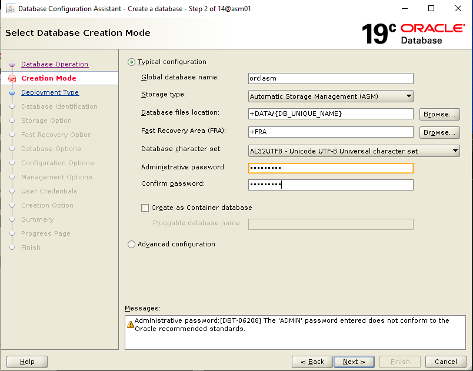


3. Summary: 
	- Finish 

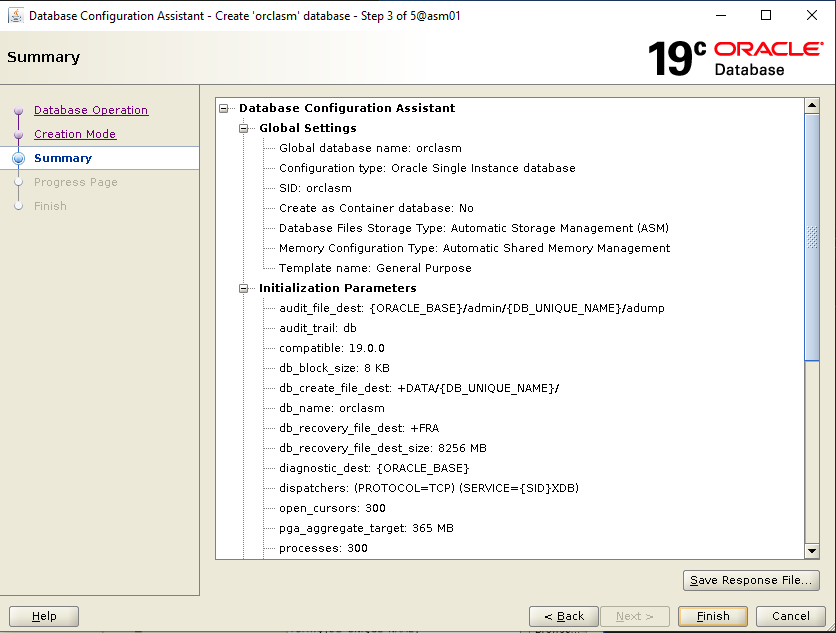

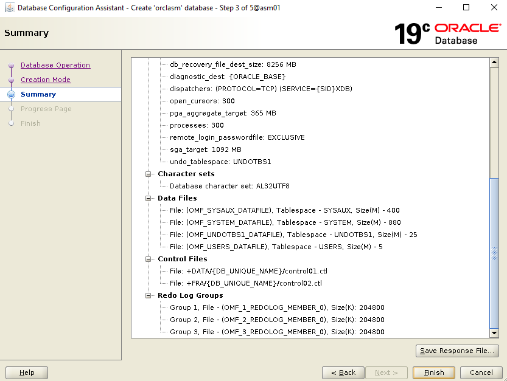


4. Progress Page: 


5. Finish: 
	- Close


#### Advanced configuration and Install: 

```
dbca
```


1. Database Operation:
	- [✔] Create a database
	- Next


2. Creation Mode: (**Advanced Recommanded**)
	- [✔] Advanced configuration:
	- Next 


3. Deployment Type: 
	- Database type: `Oracle single instance database`
	- Select a template for your database:
		- [ ] Data Warehouse
		- [ ] Custom Database 
		- [✔] General Purpose or Transaction Processing
		- Next


4. Database Identification: 
	- Global database name: `orclasm`
	- SID: `orclasm`
	- [✔] Create as container database   [If container DB no create for this uncheck it, by default checked]
		- [✔] Use Local Undo tablespace for PDBs
		- [ ] Create an empty Container database
		- [✔] Create a Container database with one or more PDBs
		- Number of PDBs: 1
		- Pluggable database name: `pdb1`
	- Next.


5. Storage Option: 
	- [ ] Use template file for database storage attributes
	- [✔] Use Following for the database storage attributes
		- Database files storage type: `Automatic Storage Management (ASM)`
		- Database files location: `+DATA/{DB_UNIQUE_NAME}/`
	- [✔] Use Oracle-Managed Files (OMF) (Default checked)
	- Next 


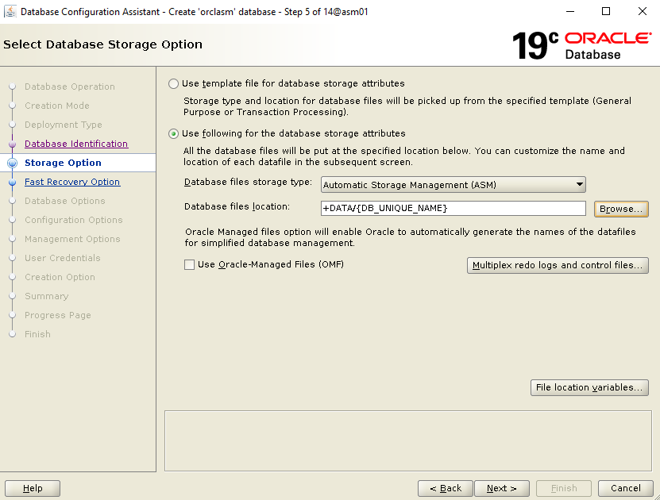


6. Fast Recovery Option: (You can Choose Later)
	- [✔] Specify Fast Recovery Area  [Checked it]
		- Recovery files storage type: `Automatic Storage Management (ASM)`
		- Fast Recovery Area: `+FRA`
		- Fast Recovery Area size: 8256 MB
	- [ ] Enable archiving 
	- Next


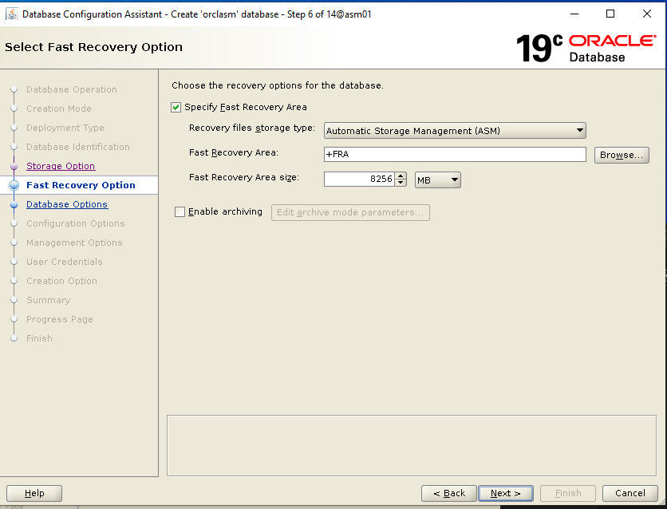


7. Network Configuration: 
	- Listener selection: [Create later]
	- Next


8. Data Vault Option: 
	- [ ] Configure Oracle Database Vault
	- [ ] Configure Oracle Label Security 
	- Next


9. Configuration Options: 
	- Memory Tab: 
		- [✔] Use Automatic Shared Memory Management
			- SGA size: `1092 MB`
			- PGA size: ` 365 MB `
		- [ ] Use Manual Shared Memory Management
		- [ ] Use Automatic Memory Management
			- Memory target: [  ]    

	- Character sets Tab:
		- [✔] Use Unicode (AL32UTF8)
	- Connection mode Tab:
		- [✔] Dedicated server mode
	- Sample schemas 
		- [✔] Add sample schemas to the database 
	- Next


10. Management Options:
	- [✔] Configure Enterprise Manager (EM) database express:
		- EM database express port: `5500`
		- [ ] Configure EM database express port as global port
	- [ ] Register with Enterprise Manager (EM) cloud control 
	- Next


11. User Credentials: 
	- [ ] Use different administrative passwords:
		- SYS: 
		- SYSYEM: 
		- PDBADMIN: 
	- [✔] Use the same administrative password for all accounts:
		- Password: oracle1234
	- Next


12. Creation Option: 
	- [✔] Create database
		- Port DB creation scripts: [  ]
	- [ ] Save as a database template
	- [ ] Generate database creation scripts
	- Next


13. Summary: 
	- Finish


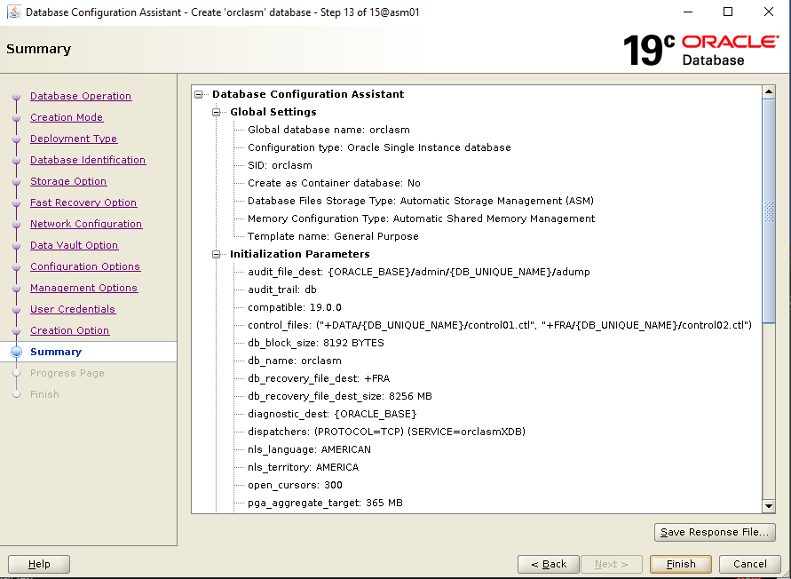
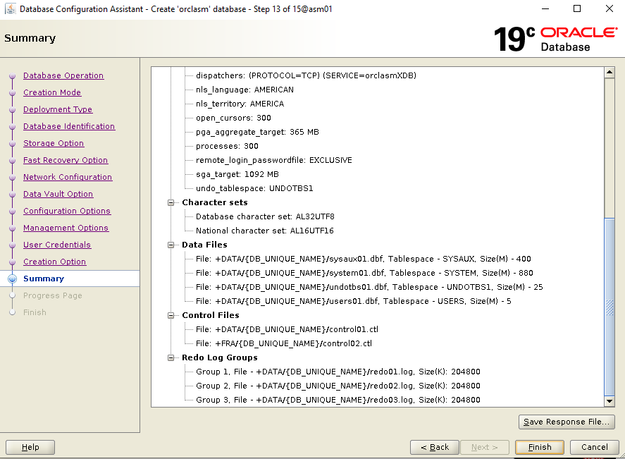


14. Progress Page:

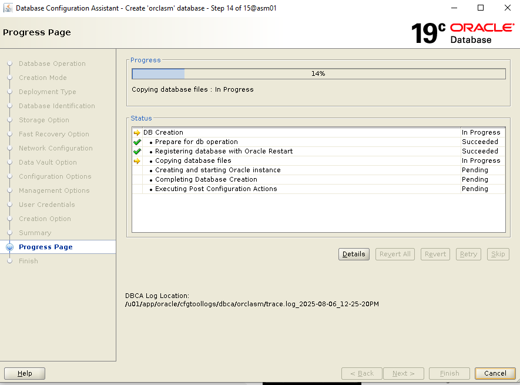


15. Finish:
	- Close


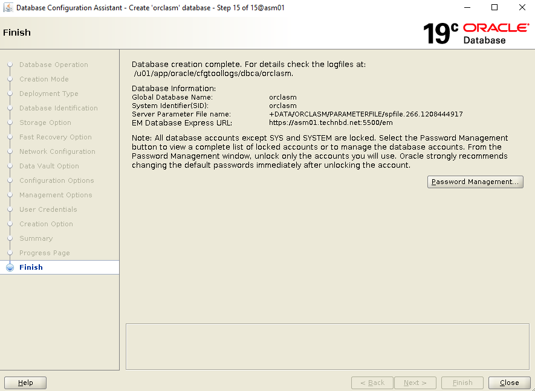


#### Verify:


```
ps -ef | grep pmon

grid     17447     1  0 00:04 ?        00:00:03 asm_pmon_+ASM
oracle   21254     1  0 15:11 ?        00:00:00 ora_pmon_orclasm
```


```
ps -ef | grep smon

grid     17485     1  0 00:04 ?        00:00:00 asm_smon_+ASM
oracle   21303     1  0 15:11 ?        00:00:00 ora_smon_orclasm
```


```
sqlplus / as sysdba
```


```
show parameter ins


NAME                                 TYPE        VALUE
------------------------------------ ----------- ------------------------------
active_instance_count                integer
cluster_database_instances           integer     1
dst_upgrade_insert_conv              boolean     TRUE
instance_abort_delay_time            integer     0
instance_groups                      string
instance_mode                        string      READ-WRITE
instance_name                        string      orclasm
instance_number                      integer     0
instance_type                        string      RDBMS
instant_restore                      boolean     FALSE
open_links_per_instance              integer     4
```


### Troubleshooting:


### License:
This project is licensed under the MIT License.


